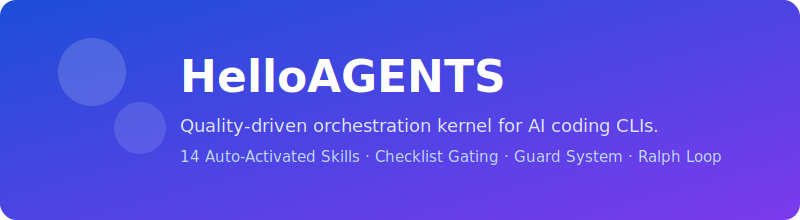

<div align="center">
  
</div>

# HelloAGENTS

<div align="center">

**质量驱动的 AI 编码 CLI 工作流框架 — 14 个自动激活技能、流程纪律、检查清单把关。**

[](./package.json)
[](https://www.npmjs.com/package/helloagents)
[](./package.json)
[](./skills)
[](./LICENSE.md)
[](https://github.com/hellowind777/helloagents/issues)

</div>

<p align="center">
  <a href="./README.md"></a>
  <a href="./README_CN.md"></a>
</p>

---

> [!IMPORTANT]
> **找 v2.x？** 旧版 Python 代码库已迁移到独立归档仓库：[helloagents-archive](https://github.com/hellowind777/helloagents-archive)。v3.x 是完全重写 — 纯 Node.js/Markdown 架构，无 Python 依赖。

## 📑 目录

<details>
<summary><strong>点击展开</strong></summary>

- [🎯 为什么选择 HelloAGENTS？](#-为什么选择-helloagents)
- [🆚 相比 v2.3.8 的变化](#-相比-v238-的变化)
- [✨ 核心特性](#-核心特性)
- [🚀 快速开始](#-快速开始)
- [🔄 安装链路与文件写入](#-安装链路与文件写入)
- [📖 命令](#-命令)
- [🔧 配置](#-配置)
- [⚙️ 工作原理](#️-工作原理)
- [📚 使用指南](#-使用指南)
- [🧪 验证](#-验证)
- [❓ FAQ](#-faq)
- [🛠️ 故障排除](#️-故障排除)
- [📈 版本历史](#-版本历史)
- [📜 许可证](#-许可证)

</details>

## 🎯 为什么选择 HelloAGENTS？

你有没有遇到过这种情况：AI 编码助手分析了一通，最后来一句"建议你这样做"就结束了？或者写了代码但跳过测试、忽略边界情况，然后说"完成了"？

HelloAGENTS 就是为了解决这个问题。它是一个编排层，装在你的 AI CLI 上面，在每一步都强制执行质量标准。

<table>
<tr>
<td width="50%" valign="top" align="center">

**没有 HelloAGENTS**


</td>
<td width="50%" valign="top" align="center">

**有 HelloAGENTS**


</td>
</tr>
</table>

| 挑战 | 没有 HelloAGENTS | 有 HelloAGENTS |
|------|-----------------|----------------|
| **止步于规划** | 给建议就结束 | 推进到实现和验证 |
| **质量不一致** | 看 prompt 运气 | 14 个技能按任务类型自动激活 |
| **危险操作** | 容易误执行破坏性命令 | Guard 系统拦截危险命令 |
| **没有验证** | "应该能用" | Ralph Loop 完成前自动跑 lint/test/build |
| **知识丢失** | 上下文散落各处 | 项目知识库持久化并持续积累 |

### 💡 最适合
- ✅ **使用 AI CLI 的开发者**，想要一致的、经过验证的输出
- ✅ **团队**，需要 AI 辅助编码的质量护栏
- ✅ **复杂项目**，需要结构化的 设计 → 开发 → 验证 工作流

### ⚠️ 不适合
- ❌ 简单的一次性问题（HelloAGENTS 会增加流程开销）
- ❌ 非编码任务（针对软件工程优化）

## 🆚 相比 v2.3.8 的变化

如果你上一次认真使用 HelloAGENTS 还是 `v2.3.8`，这一代的变化不是“增量补丁”，而是整条产品线重构。

| 维度 | v2.3.8 | 本地 `v3.0.7` |
|------|--------|---------------|
| **底层实现** | Python 包 + 大量脚本/规则混合 | 纯 Node.js + Markdown 运行时，围绕 `cli.mjs`、`bootstrap*.md`、`skills/`、`scripts/` 重建 |
| **目标定位** | 更像多 CLI 管理工具 + 提示协议集合 | 更像 AI CLI 的质量工作流框架，重点是路由、把关、验证和可恢复执行 |
| **安装方式** | pip / uv / npx / 一键脚本并行存在 | npm 为主；安装包后再显式部署到 Claude / Gemini / Codex |
| **CLI 支持策略** | 6 个目标，能力差异很大 | 聚焦 3 个主战场：Claude Code、Gemini CLI、Codex CLI |
| **工作流模型** | R0/R1/R2 三层路由 + 老式 design/develop 语义 | ROUTE/TIER → SPEC → PLAN → BUILD → VERIFY → CONSOLIDATE 六阶段主流程 |
| **命令体系** | 15 个命令，含 `~exec` / `~rollback` / `~rlm` / `~validatekb` | 12 个聚焦命令：`~idea` / `~plan` / `~build` / `~verify` / `~prd` / `~loop` / `~wiki` 等 |
| **质量模型** | 规则较分散，更多依赖自然语言约束 | 14 个自动激活技能 + 检查清单把关 + Ralph Loop + 结构化证据 |
| **项目状态** | 知识库更多是附属能力 | `.helloagents/` 成为项目激活边界，`STATE.md` / 方案包 / `DESIGN.md` / `contract.json` 组成主流程的主要判断依据 |
| **知识库存储** | 默认项目本地 | 默认项目本地，同时新增 `project_store_mode=repo-shared`，支持同一 git 仓库多个 worktree 共享稳定知识和方案资产 |
| **Codex 集成** | 早期依赖更多兼容层和旧链路 | 标准模式使用注入规则 + 本地链接；全局模式使用原生本地插件链路，减少噪音与漂移 |

一句话概括：`v2.3.8` 更像“给多个 CLI 加一层工作流外壳”，`v3.0.7` 更像“把质量协议、计划产物、验证证据和安装生命周期统一成一套真正可运转的工作流框架”。

## ✨ 核心特性

HelloAGENTS 通过三重机制协同保障质量：

<table>
<tr>
<td width="50%" valign="top">


**🎯 14 个自动激活质量技能**

技能根据你正在做的事情自动激活，无需配置。
- UI、安全、API、架构、性能
- 测试、错误处理、数据、代码审查
- 调试、子代理、文档、验证、反思

**你的收益：** 每个任务都能得到正确的质量检查，不用你记着去要求。

</td>
<td width="50%" valign="top">


**📋 检查清单把关**

编码完成后，HelloAGENTS 收集所有已激活技能的交付检查清单，逐项验证通过才能报告完成。

**你的收益：** 没有真正通过质量检查的东西不会被标记为"完成"。

</td>
</tr>
<tr>
<td width="50%" valign="top">


**🛡️ Guard 系统 + Ralph Loop**

L1 拦截破坏性命令（`rm -rf /`、`git push --force`、`DROP DATABASE`）。L2 扫描硬编码密钥和安全模式。Ralph Loop 在每个任务后自动运行验证命令。

**你的收益：** 零配置的安全防护，每次输出都经过验证。

</td>
<td width="50%" valign="top">


**⚡ 结构化工作流**

简单任务保持快速。复杂任务走“先选路再执行”的主流程：ROUTE/TIER → SPEC → PLAN → BUILD → VERIFY → CONSOLIDATE，并通过显式命令通道拆分脑暴、规划、实现与验证。

**你的收益：** 按需投入 — 简单任务保持快速，复杂任务获得完整流程。

</td>
</tr>
<tr>
<td width="50%" valign="top">


**🧠 结构化计划产物**

复杂任务不再只靠一段自然语言方案，而是落成 `requirements.md`、`plan.md`、`tasks.md`、`contract.json`、`STATE.md`、`DESIGN.md` 等可追踪产物。

**你的收益：** 路由、实现、验证、收尾都围绕同一组判断依据推进，不容易中途漂移。

</td>
<td width="50%" valign="top">


**🗂️ 本地 / 共享双存储**

默认把知识库和方案包放在项目本地 `.helloagents/`；如果你有多个 worktree，可以切到 `project_store_mode=repo-shared`，把稳定项目知识共享到 `~/.helloagents/projects/<repo-key>/`。

**你的收益：** 保留本地运行态隔离，同时避免在多个 worktree 间复制方案和知识库。

</td>
</tr>
</table>

## 🚀 快速开始

### 1）先安装

```bash
npm install -g helloagents
```

如果你的系统 `PATH` 里已经存在其他同名 `helloagents` 可执行文件，可以改用内置的稳定别名：

```bash
helloagents-js
```

`postinstall` 现在只负责安装包和初始化 `~/.helloagents/helloagents.json`，**不会自动部署到任何 CLI**。

安装包后，用显式命令部署到目标 CLI：

```bash
helloagents install codex --standby
helloagents install --all --standby
```

> 注意：`npm install helloagents`（不带 `-g`）同样只会安装包本身，不会自动改任何 CLI 配置。

### 2）选择模式

| 目标 | 执行命令 | 结果 |
|------|----------|------|
| 先安装包，不立即改宿主 | `npm install -g helloagents` | 仅安装命令与 `~/.helloagents/helloagents.json` |
| 默认保持轻量 | `helloagents install --all --standby` | **标准模式**：显式为目标 CLI 注入精简规则 |
| 所有项目启用完整规则 | `helloagents install --all --global` 或 `helloagents --global` | 切到 **全局模式**：Claude/Gemini 走原生插件/扩展，Codex 自动安装原生本地插件链路 |
| 本地切分支/改文件后重新同步 | `helloagents update codex`、`helloagents install --all --standby`、`helloagents --global` | 按目标或当前模式刷新已注入/已复制的文件 |

### 2.1）按单个 CLI 管理

```bash
helloagents install codex --standby
helloagents install --all --global
helloagents update codex
helloagents cleanup claude --global
helloagents uninstall gemini
```

- 支持的目标：`claude`、`gemini`、`codex`
- 省略 `--standby` / `--global` 时：优先沿用该 CLI 已记录或已检测到的模式；如果没有历史记录，则回退到 `standby`
- `install` / `update` 只处理目标 CLI；用 `--all` 可显式批量处理全部目标
- Claude Code / Gemini CLI 在 `global` 模式下仍需手动执行原生插件/扩展安装或卸载命令；Codex CLI 仍由 HelloAGENTS 自动处理本地插件链路

如需所有项目启用完整规则，切换到全局模式：

```bash
helloagents --global
```

然后按需为你的 CLI 安装原生插件/扩展：

```bash
# Claude Code
/plugin marketplace add hellowind777/helloagents

# Gemini CLI
gemini extensions install https://github.com/hellowind777/helloagents
```

Codex CLI 无需手动执行插件命令。`helloagents --global` 会自动走原生本地插件链路，写入：
- `~/.agents/plugins/marketplace.json`
- `~/plugins/helloagents/`
- `~/.codex/plugins/cache/local-plugins/helloagents/local/`
- `~/.codex/config.toml` 中的 `helloagents@local-plugins`

### 3）在对话里验证

```bash
# 在 AI CLI 对话中输入：
~help
```

**预期输出：**
```
💡【HelloAGENTS】- 帮助

可用命令: ~idea, ~auto, ~plan, ~build, ~prd, ~loop, ~wiki, ~init, ~test, ~verify, ~commit, ~clean, ~help

自动激活技能 (14): hello-ui, hello-api, hello-security, hello-test, hello-verify, hello-errors, hello-perf, hello-data, hello-arch, hello-debug, hello-subagent, hello-review, hello-write, hello-reflect
```

### 4）首次使用

```bash
# 简单任务 — 直接执行
"修复 src/utils.ts 第 42 行的拼写错误"

# 复杂任务 — 用 ~auto 走完整流程
~auto "添加基于 JWT 的用户认证"

# 想先看方案？
~plan "重构支付模块"
```

## 🔄 安装链路与文件写入

HelloAGENTS 在不同模式下会写入不同文件，但写入/恢复/清理都是可预期的。

### 标准模式（默认）

| CLI | HelloAGENTS 会写入/更新的文件 | 保留什么 | 卸载 / 切模式时会清什么 |
|-----|------------------------------|----------|-------------------------|
| Claude Code | `~/.claude/CLAUDE.md`、`~/.claude/settings.json`、`~/.claude/helloagents -> <包根目录>` | 现有非 HelloAGENTS markdown、settings、permissions、hooks | 删除注入标记块、HelloAGENTS hooks/permissions 和符号链接 |
| Gemini CLI | `~/.gemini/GEMINI.md`、`~/.gemini/settings.json`、`~/.gemini/helloagents -> <包根目录>` | 现有 markdown、hooks 和无关配置 | 删除注入标记块、HelloAGENTS hooks 和符号链接 |
| Codex CLI | `~/.codex/AGENTS.md`、`~/.codex/config.toml`、形如 `~/.codex/config.toml_YYYYMMDD-HHMMSS.bak` 的时间戳备份、`~/.codex/helloagents -> <包根目录>` | 通过 backup/restore 保留原有顶层 TOML 配置和无关 section | 删除注入标记块、HelloAGENTS TOML 键、符号链接以及最新的 HelloAGENTS 托管备份 |

### 全局模式

| CLI | 安装方式 | 相关文件 |
|-----|---------|----------|
| Claude Code | 原生插件安装（手动命令） | 由 Claude 插件系统管理 |
| Gemini CLI | 原生扩展安装（手动命令） | 由 Gemini 扩展系统管理 |
| Codex CLI | 原生本地插件链路（自动） | `~/.agents/plugins/marketplace.json`、`~/plugins/helloagents/`、`~/.codex/plugins/cache/local-plugins/helloagents/local/`、`~/.codex/config.toml` |

### 更新 / 重装 / 切分支行为

- **标准模式** 通过 `~/.claude/helloagents`、`~/.gemini/helloagents`、`~/.codex/helloagents` 这三个符号链接保持脚本、技能、模板和 hooks 与包根目录同步，相关链接文件会立即反映本地变化；但 `CLAUDE.md`、`GEMINI.md`、`AGENTS.md` 这类注入后的规则文件仍是快照，bootstrap 或分支变化后需要显式刷新。
- **Codex 全局模式** 使用复制后的运行时文件。重新执行 `helloagents --global` 会刷新 `~/plugins/helloagents/` 和 Codex cache 中的副本。
- 重新执行当前模式命令是被支持的：`helloagents --standby` 和 `helloagents --global` 都是 **切换或刷新** 命令。
- 如需确定性的手动清理，先执行 `helloagents cleanup`，再执行 `npm uninstall -g helloagents`。
- `npm uninstall -g helloagents` 会移除包本身；`~/.helloagents/helloagents.json` 会被有意保留。

## 📖 命令

所有命令在 AI 对话中使用 `~` 前缀：

**工作流命令：**

| 命令 | 说明 |
|------|------|
| `~idea` | 轻量点子探索 — 比较方向与方案，不写文件 |
| `~auto` | 自动编排 — 自动选择主路径并持续衔接到实现 / 验证 / 收尾，并优先复用现有活跃方案包 |
| `~plan` | 结构化规划 — 需求澄清 + 方案收敛 + 计划包 |
| `~build` | 执行实现 — 基于当前需求或现有计划包完成实现 |
| `~prd` | 完整 PRD — 13 维度头脑风暴式探索，生成产品需求文档 |
| `~loop` | 自主迭代优化 — 设定目标和指标，AI 循环改进直到达标 |

**质量命令：**

| 命令 | 说明 |
|------|------|
| `~test` | 编写完整测试（TDD：Red → Green → Refactor） |
| `~verify` | 统一验证入口 — 审查、lint、typecheck、test、build 与修复循环 |

**工具命令：**

| 命令 | 说明 |
|------|------|
| `~wiki` | 仅创建/同步项目知识库（`.helloagents/`） |
| `~init` | 完整初始化项目：知识库 + 项目级规则文件 |
| `~commit` | 生成规范化提交信息 + 知识库同步 |
| `~clean` | 归档已完成方案，清理临时文件 |
| `~help` | 显示所有命令和当前配置 |

兼容别名：
- `~design` → `~plan`
- `~do` → `~build`
- `~review` → `~verify`（审查优先模式）

## 🔧 配置

配置文件：`~/.helloagents/helloagents.json`（安装时自动创建）

只需包含你想覆盖的键，缺失的键使用默认值。

```json
{
  "output_language": "",
  "output_format": true,
  "notify_level": 0,
  "ralph_loop_enabled": true,
  "guard_enabled": true,
  "kb_create_mode": 1,
  "project_store_mode": "local",
  "commit_attribution": "",
  "install_mode": "standby"
}
```

| 配置项 | 默认值 | 说明 |
|--------|-------|------|
| `output_language` | `""` | 空=跟随用户语言，填写 `zh-CN`、`en` 等指定 |
| `output_format` | `true` | `true`=仅主代理在流式结束后的最终收尾回复可使用 HelloAGENTS 布局；所有流式/进度/中间输出及所有子代理输出保持自然；`false`=自然输出 |
| `notify_level` | `0` | `0`=关闭，`1`=桌面通知，`2`=声音，`3`=两者 |
| `ralph_loop_enabled` | `true` | 任务完成时自动运行验证 |
| `guard_enabled` | `true` | 拦截危险命令 |
| `kb_create_mode` | `1` | `0`=关闭，`1`=已激活项目或全局模式中的编码任务自动，`2`=已激活项目或全局模式中始终 |
| `project_store_mode` | `"local"` | `"local"`=知识库/方案包保留在项目本地 `.helloagents/`；`"repo-shared"`=本地 `.helloagents/` 仅保留激活/STATE/运行态，知识库与方案包改写到 `~/.helloagents/projects/<repo-key>/` |
| `commit_attribution` | `""` | 空=不添加，填写内容则追加到 commit message |
| `install_mode` | `"standby"` | `"standby"`=按项目激活（精简规则），`"global"`=所有项目启用完整规则 |

<details>
<summary>📝 常见配置场景</summary>

**切换到全局模式（所有项目启用完整规则）：**
```bash
helloagents --global
```

**切换回标准模式（默认）：**
```bash
helloagents --standby
```

**纯英文输出：**
```json
{ "output_language": "en" }
```

**关闭知识库自动创建：**
```json
{ "kb_create_mode": 0 }
```

**多个 worktree 共享知识库和方案包：**
```json
{ "project_store_mode": "repo-shared" }
```

**开启桌面+声音通知：**
```json
{ "notify_level": 3 }
```

**关闭 Guard（不推荐）：**
```json
{ "guard_enabled": false }
```

</details>

## ⚙️ 工作原理

**简单说：** HelloAGENTS 根据任务类型、风险等级和项目状态选择执行深度。标准模式下，未激活项目只保留轻量规则：安全、完成约束、压缩版质量下限，以及显式 `~command` 通道；一旦项目通过 `.helloagents/` 激活，或启用全局模式，就切换到完整主流程，显式经过脑暴、规划、实现、验证与收尾阶段。

**六阶段主流程：**

1. **ROUTE / TIER** — 判断当前任务应进入 `~idea`、`~plan`、`~build`、`~verify`、`~prd` 还是 `~auto`
2. **SPEC** — 明确目标、约束与成功标准
3. **PLAN** — 标记所需质量技能，并准备 `requirements.md`、`plan.md`、`tasks.md` 等结构化产物
4. **BUILD** — 实现，TDD（写测试 → 写代码 → 重构），每步后增量验证
5. **VERIFY** — 运行 Ralph Loop，需要时先审查 diff，再收集交付检查清单
6. **CONSOLIDATE** — 更新 `STATE.md`、同步知识库、归档计划包

**Delivery Tier：**
- `T0` — 只读探索、点子比较、方向发散
- `T1` — 低风险小改动、明确实现、显式验证
- `T2` — 多文件功能、新项目、需要结构化产物的任务
- `T3` — 高风险或不可逆链路，如认证、安全、支付、数据库、生产发布

**路由规则：**
- 点子探索 / 比较方向 → `~idea`
- 简单任务（单文件、明确修复）→ 直接执行或 `~build`
- 复杂任务（3+ 文件、架构变更、新项目）→ 通过 `~plan`、`~auto` 或 `~prd` 走完整流程
- 审查 / 验证类任务 → `~verify`

**按任务类型生效的质量规则与技能：**
- UI / 前端 / 视觉交互任务始终先遵循当前 bootstrap 文件中的 UI 质量基线
- 在已激活项目、全局模式或显式 UI 工作流命令中，`hello-ui` 会进一步补充设计契约执行、设计系统映射与视觉验收
- 只有当 UI `contract.json` 显式要求更强 UI 保障时，HelloAGENTS 才会在保持默认路径轻量的前提下，额外引入 `.helloagents/.ralph-advisor.json` 和 `.helloagents/.ralph-visual.json`
- 涉及 API？→ `hello-api` 激活（REST 规范、校验、错误格式）
- 任何代码变更？→ `hello-test`、`hello-verify`、`hello-review` 激活

### 标准模式 vs 全局模式

HelloAGENTS 支持两种安装模式，采用不同的安装方式：

| 模式 | 安装方式 | 规则 | 技能 | 适用场景 |
|------|---------|------|------|----------|
| **标准模式** (默认) | `helloagents install <target> --standby` 或 `helloagents install --all --standby` | `bootstrap-lite.md`（含压缩版质量下限、UI 质量基线、安全规则与完成约束的精简规则） | `~command` 按需使用；激活前 UI 任务仍受 UI 质量基线约束，出现 `.helloagents/` 后切换到完整流程 | 按需使用，不影响其他项目 |
| **全局模式** | Claude/Gemini 手动装插件；Codex 自动装原生本地插件 | `bootstrap.md`（完整规则） | 14 个技能自动激活 | 全面使用 HelloAGENTS |

标准模式会把规则注入到 `~/.claude/CLAUDE.md`、`~/.gemini/GEMINI.md`、`~/.codex/AGENTS.md`；对于 Codex，HelloAGENTS 还会在 `~/.codex/config.toml` 中写入一条受管的 `model_instructions_file`，指向同步后的 `~/.codex/AGENTS.md`，让同一份 home carrier 同时成为 Codex 的 base instructions override。执行清理时会恢复用户原来的 `model_instructions_file`。每个 CLI 还会创建 `helloagents` 包根目录符号链接。Claude Code 和 Gemini 仍使用 hooks，因为宿主可以较安静地承载这类注入；Codex 默认**不启用** HelloAGENTS hooks：最新 pre 源码里 hook 生命周期会在 TUI 中可见显示，且 `suppressOutput` 不能作为真正的静默注入通道，所以 Codex 改为依赖注入后的规则文件，以及本地符号链接 / 原生本地插件目录结构。全局模式下，Claude Code 通过 `.claude-plugin/plugin.json` 中声明的 hooks 工作，Gemini 通过 `contextFileName=bootstrap.md` 和扩展 hooks 工作；Codex 仍使用原生本地插件安装链路（marketplace + 本地插件目录 + cache + `config.toml` 插件启用段），并继续使用同一份 `~/.codex/AGENTS.md` home 基线，但不启用插件 hooks。

在标准模式下，`.helloagents/` 就是项目激活边界。激活前，lite 规则**不会**进入完整六阶段主流程，也不会启用语义自动选路；它只保留轻量执行规则、显式 `~command` 入口，以及最低质量/完成门槛。项目一旦存在 `.helloagents/`，当前项目就切换到完整项目流程，并以 `bootstrap.md` 作为运行时判断依据。

整套切换可用：`helloagents --global` 或 `helloagents --standby`

重复执行当前模式命令也是合法的。它会在本地切分支、开发调试或手工清理后刷新当前模式下的注入/复制文件。

## 📚 使用指南

### 核心工作流通道

| 模式 | 说明 | 适用场景 |
|------|------|----------|
| `~idea` | 仅做轻量探索，不写文件 | 想先比较方向，不想进入完整项目流程 |
| `~plan` | 仅做交互式规划，生成计划包 | 想先审查方案再编码 |
| `~build` | 从当前需求或现有计划包执行实现 | 需求已明确，想直接开始做 |
| `~verify` | 审查与验证工作流 | 想先看审查结果、跑检查并修复 |
| `~auto` | 在以上模式之间自动编排并一路推进 | 需求明确，想要端到端交付 |
| `~prd` | 13 维度 PRD 生成 | 需要完整的产品需求文档 |

典型模式：先 `~idea` 比较方向，再 `~plan` 收敛方案，然后 `~build` 实现，最后 `~verify` 验证。或者直接 `~auto` 一步到位。如果项目里已经有活跃方案包，`~auto` 应先复用这条现有链路，而不是无故重新脑暴或重新规划。涉及 UI 时，决策优先级固定为：`plan.md` / PRD 中的 UI 决策 → `DESIGN.md` → 通用 UI 规则。

### 质量验证（Ralph Loop）

每个任务完成后，Ralph Loop 自动运行项目的验证命令：
- 优先级：逻辑 `.helloagents/verify.yaml`（`project_store_mode=repo-shared` 时解析到共享知识目录）→ `package.json` scripts → 自动检测
- 全部通过？→ 收集技能检查清单 → 验证 → 完成
- 有失败？→ 反思 → 修复 → 重跑（3 次连续失败后触发熔断）
- 若当前活跃方案包仍有未完成任务、缺少必需结构化产物，或残留模板占位内容，交付也会被额外把关拦下

### 知识库（`.helloagents/`）

`~wiki` 只创建或同步项目知识库。`~init` 是更完整的项目初始化：它还会写入项目级规则文件（`AGENTS.md`、`CLAUDE.md`、`.gemini/GEMINI.md`）、刷新各宿主项目级原生 skills 链接，并补齐相关忽略项。在标准模式下，真正让当前项目进入完整项目流程的是项目本地 `.helloagents/` 的存在，项目级规则文件只是 `~init` 的附加能力。

默认情况下，知识库和方案包都写在项目本地 `.helloagents/`。若 `project_store_mode = "repo-shared"`，本地 `.helloagents/` 仅保留激活信号、`STATE.md` 与 `.ralph-*` 等运行态文件；`context.md`、`guidelines.md`、`DESIGN.md`、`verify.yaml`、`modules/`、`plans/`、`archive/` 会改写到 `~/.helloagents/projects/<repo-key>/`，从而在同一 git 仓库的多个 worktree 间共享稳定资料。

`STATE.md` 是项目级恢复快照，不是所有交互的统一记忆文件。它会在 `~wiki`、`~init`、`~plan`、`~build`、`~auto`、`~prd`、`~loop` 这类项目级连续流程中创建并持续更新；在验证/审查类任务中仅在文件已存在时更新；对 `~help` 这类一次性只读交互则不会创建。

| 文件 | 用途 |
|------|------|
| `STATE.md` | 项目级恢复快照（≤70 行，压缩后可据此续接） |
| `DESIGN.md` | 项目级 UI 契约（设计系统、组件模式、状态覆盖、无障碍要求） |
| `context.md` | 项目架构、技术栈、约定 |
| `guidelines.md` | 非显而易见的编码规则 |
| `verify.yaml` | 验证命令 |
| `CHANGELOG.md` | 变更历史 |
| `modules/*.md` | 模块文档 + 经验 |
| `plans/` | 活跃计划包（`requirements.md`、`plan.md`、`tasks.md`、`contract.json`） |
| `archive/` | 已完成计划包 |

### 智能提交（~commit）

- 分析 `git diff` 生成 Conventional Commits 格式消息
- 提交前质量检查（代码-文档一致性、测试覆盖）
- 自动排除敏感文件（`.env`、`*.pem`、`*.key`）
- 遵循 `commit_attribution` 配置
- 按 `kb_create_mode` 设置同步知识库

### 自主迭代优化（~loop）

设定目标和指标，让 AI 自主迭代：
1. 审查 → 构思 → 修改 → 提交 → 验证 → 决策 → 记录 → 重复
2. 结果记录在 `.helloagents/loop-results.tsv`
3. 失败实验使用 `git revert` 干净回滚

## 🧪 验证

HelloAGENTS 使用 Node 内置测试运行器：

```bash
npm test
```

测试覆盖：
- 标准/全局模式的安装、重装、刷新、卸载、模式切换
- Claude / Gemini / Codex 配置文件的合并、恢复、清理行为
- Codex 本地插件在本地切分支或文件更新后的刷新链路
- 运行时 inject / route / guard / Ralph Loop 链路
- `~/.codex/` 已不存在时，Codex 全局产物的清理行为

## ❓ FAQ

<details>
<summary><strong>Q：这是 CLI 工具还是 prompt 框架？</strong></summary>

**A：** 两者都是。CLI（`cli.mjs`）负责安装、模式切换和 CLI 配置。实际工作流来自 `bootstrap.md` / `bootstrap-lite.md` 规则、质量技能，以及按宿主选择的运行时辅助链路。Claude/Gemini 会使用 `notify.mjs`、`guard.mjs`、`ralph-loop.mjs` 等 hooks；Codex 默认走规则文件驱动，尽量保持 TUI 安静。可以理解为：交付系统 + 智能质量协议。
</details>

<details>
<summary><strong>Q：v2.x 到 v3.x 有什么变化？</strong></summary>

**A：** 全部重写了：
- Python 包 → 纯 Node.js/Markdown 架构
- 15 个命令 → 12 个命令 + 14 个自动激活质量技能
- 6 个 CLI 目标 → 3 个（Claude Code + Codex CLI + Gemini CLI）
- 新增：检查清单把关、Guard 系统、~prd、~loop、~verify、设计系统生成
- 详见[版本历史](#-版本历史)。
</details>

<details>
<summary><strong>Q：该用哪个 CLI？</strong></summary>

**A：** Claude Code 体验最好（插件系统、11 个生命周期 hooks、Agent Teams 支持）。Gemini CLI 通过扩展系统支持。Codex CLI 也不错。先安装包，再用 `helloagents install <target> --standby` 或 `helloagents install --all --standby` 显式部署到你要用的 CLI。
</details>

<details>
<summary><strong>Q：14 个质量技能是什么？</strong></summary>

**A：** 按任务类型自动激活：
- **hello-ui**：深层 UI 实现与验收（设计契约、设计系统映射、无障碍、响应式、动画）
- **hello-api**：API 设计（REST、校验、错误格式、限流）
- **hello-security**：安全（认证、输入校验、XSS/CSRF、密钥管理）
- **hello-test**：测试（TDD 流程、边界用例、AAA 模式）
- **hello-verify**：验证把关（Ralph Loop、熔断器）
- **hello-errors**：错误处理（结构化错误、日志、恢复策略）
- **hello-perf**：性能（N+1、缓存、代码分割、虚拟滚动）
- **hello-data**：数据库（迁移、事务、索引、完整性）
- **hello-arch**：架构（SOLID、边界、代码体积限制）
- **hello-debug**：调试（四阶段流程、卡住时升级）
- **hello-subagent**：子代理编排（分发、协调、审查）
- **hello-review**：代码审查（逻辑、安全、性能、可维护性）
- **hello-write**：文档（金字塔原则、受众感知）
- **hello-reflect**：经验捕获（教训 → 知识库）

子代理只跳过路由、交互流程和输出包装；编码原则、安全约束、失败处理等基础规则仍然持续生效。
</details>

<details>
<summary><strong>Q：标准模式和全局模式有什么区别？</strong></summary>

**A：** 标准模式（默认）把精简规则部署到你明确指定的目标 CLI，通常用 `helloagents install <target> --standby` 或 `helloagents install --all --standby`。项目只要建立了 `.helloagents/` 就会进入完整项目流程，通常通过 `~wiki`（仅知识库）或 `~init`（完整初始化）完成。全局模式使用各 CLI 原生的插件/扩展系统，所有项目自动启用完整规则；可用 `helloagents install <target> --global`、`helloagents install --all --global`，或通过 `helloagents --global` 做整套切换。
</details>

<details>
<summary><strong>Q：项目知识存在哪里？</strong></summary>

**A：** 默认在项目本地 `.helloagents/` 目录。可以由 `~wiki`（仅知识库）或 `~init`（完整项目初始化）创建；之后会按 `kb_create_mode` 在代码变更场景中自动同步。若 `project_store_mode = "repo-shared"`，本地 `.helloagents/` 只保留激活信号、`STATE.md` 与 `.ralph-*` 运行态文件，知识库和方案包会改存到 `~/.helloagents/projects/<repo-key>/`。其中 `STATE.md` 只作为长流程任务的精简恢复快照，不承担所有交互的统一记忆。
</details>

<details>
<summary><strong>Q：Guard 系统是什么？</strong></summary>

**A：** 两层安全防护：
- **L1 拦截**：执行前阻止破坏性命令（`rm -rf /`、`git push --force`、`DROP DATABASE`、`chmod 777`、`FLUSHALL`）
- **L2 建议**：扫描文件写入中的硬编码密钥、API key、.env 暴露 — 警告但不阻止
</details>

<details>
<summary><strong>Q：开启格式化输出后，底部“下一步”栏表示什么？</strong></summary>

**A：** 它始终显示当前最合适的下一步动作。若存在自然后续动作，HelloAGENTS 会直接给出明确引导；若当前任务已完整结束且没有合理后续，则回落为完成/等待状态，而不是输出空洞套话。
</details>

<details>
<summary><strong>Q：仓库里还保留 ~fullstack 吗？</strong></summary>

**A：** 保留了。它更偏向高级/兼容能力，适合多项目、多技术栈协作场景。常见用法包括：
- `~fullstack init`
- `~fullstack projects`
- `~fullstack status`
- `~fullstack bind / unbind`
- `~fullstack bind wizard`
- `~fullstack kb init --all`
- `~fullstack dispatch-plan`
- `~fullstack sync`
- `~fullstack engineers`
- `~fullstack runtime set-root/get-root/clear-root`

完整说明见 [全栈模式使用指南](docs/fullstack-mode-guide.md) 和 [functions/fullstack.md](functions/fullstack.md)。
</details>

<details>
<summary><strong>Q：可以关闭不需要的功能吗？</strong></summary>

**A：** 可以。设置 `guard_enabled: false` 关闭 Guard，`ralph_loop_enabled: false` 跳过验证，`kb_create_mode: 0` 关闭知识库。质量技能自动激活但不会给无关任务增加开销。
</details>

<details>
<summary><strong>Q：~prd 是什么？</strong></summary>

**A：** 13 维度 PRD 生成器。逐维度走过：产品概述、用户故事、功能需求、UI/UX 设计、技术架构、非功能需求、国际化、无障碍、内容策略、测试策略、部署运维、法律隐私、时间线 — 头脑风暴式，一次一个维度。
</details>

## 🛠️ 故障排除

### 插件未加载（Claude Code）

**问题：** 安装插件后 `~help` 无法识别

**解决：** 重启 Claude Code。如果仍不行，检查 `/plugin list` 确认安装状态。

---

### 扩展不工作（Gemini CLI）

**问题：** `gemini extensions install` 后 `~help` 无法识别

**解决：** 重启 Gemini CLI。用 `gemini extensions list` 确认安装状态，确保扩展已启用。

---

### 文件写入超出工作区范围

**问题：** Gemini CLI 或 Codex CLI 提示目标文件路径不在允许的工作区内。

**解决：** 将文件写入当前项目工作区内，或写入对应 CLI 的临时工作区目录。做 headless 验证时，优先使用当前仓库下的路径，不要随意写到任意绝对路径。

---

### 命令未找到

**问题：** 安装后 `~help` 无法识别

**解决：**
- 验证安装：`npm list -g helloagents`
- Claude Code：检查 `~/.claude/CLAUDE.md` 是否包含 HelloAGENTS 标记
- Gemini CLI：检查 `~/.gemini/GEMINI.md` 是否包含 HelloAGENTS 标记
- Codex CLI：检查 `~/.codex/AGENTS.md` 是否包含 HelloAGENTS 标记，`~/.codex/config.toml` 是否保留指向 `~/.codex/AGENTS.md` 的 `model_instructions_file` 与 `notify`
- 重启你的 CLI

---

### 本地切分支后 Codex 全局模式仍在用旧文件

**问题：** 你切换了分支，或更新了本地 link 的仓库，但 Codex 全局模式仍然加载旧的复制文件。

**解决：** 重新执行当前模式命令：
- `helloagents --global` → 刷新 `~/plugins/helloagents/` 和 Codex cache 副本
- `helloagents --standby` → 刷新标准模式下注入的文件和符号链接

---

### Guard 拦截了合法命令

**问题：** Guard 拦截了你确实想执行的命令

**解决：** 在 `~/.helloagents/helloagents.json` 中设置 `guard_enabled: false`。或者检查被拦截的命令 — Guard 只拦截真正的破坏性操作如 `rm -rf /` 和 `git push --force`。

---

### Ralph Loop 持续失败

**问题：** 验证循环无法通过

**解决：**
- 检查 `.helloagents/verify.yaml` 中的命令是否正确
- 手动运行验证命令查看实际错误
- 3 次连续失败后熔断器激活 — `hello-debug` 升级介入

---

### CCswitch 替换了 HelloAGENTS 配置

**问题：** 切换 CCswitch 配置后 HelloAGENTS 停止工作

**解决：** 切换配置后重新运行 `/plugin marketplace add hellowind777/helloagents`。CCswitch 会替换整个 CLI 配置目录。

---

### 通知不工作

**问题：** 没有声音或桌面通知

**解决：**
- 检查配置中的 `notify_level`（默认 0=关闭）
- Windows：确保 PowerShell 可以访问 `System.Media.SoundPlayer`
- macOS：确保 `afplay` 可用
- Linux：确保安装了 `aplay` 或 `paplay`

## 📈 版本历史

### v3.0.7（当前版本）

**相对 `v2.3.8` 的当前主线结果：**
- ✨ 从 Python 包全面重写为 Node.js/Markdown 工作流框架，安装、运行时注入、技能、规则与验证链路全部重建
- ✨ 把旧的多层路由 / design-develop 流程，统一收敛成 ROUTE/TIER → SPEC → PLAN → BUILD → VERIFY → CONSOLIDATE 六阶段主流程
- ✨ 从旧命令集切换到 `~idea` / `~plan` / `~build` / `~verify` / `~prd` / `~loop` / `~wiki` 等更聚焦的命令体系，并引入 14 个自动激活质量技能
- ✨ 项目产物体系成型：`STATE.md`、`DESIGN.md`、`requirements.md`、`plan.md`、`tasks.md`、`contract.json`、`.ralph-*` 证据成为流程判断依据，而不是附属文档
- ✨ 安装模型重构为标准模式 / 全局模式双轨；Codex 改为原生本地插件链路，Claude/Gemini 保留各自宿主原生能力
- ✨ 新增 `project_store_mode=repo-shared`，让同一 git 仓库的多个 worktree 可以共享稳定知识库和方案包，而本地 `.helloagents/` 继续保留激活和运行态隔离

### v3.0.4

**标准待机与运行时边界：**
- 🔧 相对 `v3.0.3`，进一步明确激活边界：完整六阶段主流程保留在 `bootstrap.md`，`bootstrap-lite.md` 作为项目激活前的待机规则文件
- ✨ 固化标准模式、未激活项目的压缩版质量下限，让轻量模式仍能维持现代技术基线、性能基线和 UI 质量要求
- 🔧 统一精修 bootstrap 的运行时术语与规则表述，在不改变既有把关模型的前提下提升准确性和专业性

### v3.0.3

**流程与知识库激活：**
- ✨ 新增 `~wiki`，用于只创建或同步 `.helloagents/`，不写项目级规则文件
- 🔧 明确标准模式下的激活边界：`.helloagents/` 才是项目进入完整流程的实际信号；项目级规则文件仍属于 `~init` 的职责
- 🔧 统一修正 bootstrap、帮助文本和 README 中 `kb_create_mode` 的表述，使其只描述已激活项目或全局模式下的同步时机
- 🧪 新增 `~wiki` 路由覆盖，并持续验证标准模式下基于 `.helloagents/` 的激活行为

### v3.0.2

**修复与验证：**
- 🔧 移除误回流到 Codex 标准/全局安装产物 `AGENTS.md` 中的静态运行时上下文前缀
- 🔧 复查 Claude / Gemini 标准模式与全局模式静态规则文件，确认本来就不存在同类已废弃运行时规则块
- 🔧 同步修正文档中关于 Codex `model_instructions_file -> ~/.codex/AGENTS.md` 和无 hooks 运行方式的表述
- 🧪 新增回归断言，确保 Codex 标准/全局规则文件中不再出现被移除的运行时上下文前缀

### v3.0.1

**修复与验证：**
- 🔧 收敛并加强 `STATE.md` 恢复规则：关键决策变更即更新，长流程一旦失真立即重写，宿主明确进入压缩/恢复前置阶段前必须先确认已同步
- 🔧 修复 Codex 本地插件链路清理后的空 `~/.agents/plugins/marketplace.json` 残留
- 🔧 修复并验证单 CLI `update` 在记录模式过期时仍会优先复用本地已检测模式，符合 `helloagents update <cli>` 的预期行为
- 🔧 明确标准模式下“链接文件立即同步、注入后的规则文件需显式刷新”的分支 / bootstrap 刷新语义
- 🧪 新增标准模式规则文件刷新、模式自动复用、Codex 空 marketplace 清理，以及与版本号无关的 npm pack 生命周期测试

### v3.0.0 🎉

**破坏性变更：**
- 🔴 完全重写：Python 包 → 纯 Node.js/Markdown 架构。`pip`/`uv` 安装方式不再可用
- 🔴 命令重命名/移除：`~design` → `~plan`、`~review` → `~verify`、`~do` → `~build`，移除 `~exec`/`~rollback`/`~rlm`/`~status`/`~validatekb`/`~upgradekb`/`~cleanplan`
- 🔴 配置键从大写改为小写。移除：`BILINGUAL_COMMIT`、`EVAL_MODE`、`UPDATE_CHECK`、`CSV_BATCH_MAX`

**新功能：**
- ✨ 14 个自动激活质量技能：hello-ui、hello-api、hello-security、hello-test、hello-verify、hello-errors、hello-perf、hello-data、hello-arch、hello-debug、hello-subagent、hello-review、hello-write、hello-reflect
- ✨ 3 个支持的 CLI：Claude Code（插件/marketplace）、Gemini CLI（扩展）、Codex CLI（npm）
- ✨ 检查清单把关：所有已激活技能必须通过交付检查清单才能完成任务
- ✨ `~prd` 命令：13 维度头脑风暴式 PRD 框架
- ✨ `~loop` 命令：自主迭代优化，带指标追踪和 git 回滚
- ✨ `~verify` 命令：自动检测并运行所有验证命令
- ✨ Guard 系统（`guard.mjs`）：L1 拦截破坏性命令 + L2 安全模式建议
- ✨ 标准/全局模式：`install_mode` 配置项支持按项目或全局激活
- ✨ 流状态管理（`STATE.md`）：用于压缩/恢复衔接的恢复快照（≤70 行）
- ✨ 设计系统生成（`DESIGN.md`）：作为项目级 UI 契约自动创建
- ✨ 计划包系统：`requirements.md` + `plan.md` + `tasks.md` + `contract.json`
- ✨ 可选 advisor 契约与证据：仅在 T3 / UI / 高风险链路启用，通过 `contract.json` + `.helloagents/.ralph-advisor.json` 落地
- ✨ 可选视觉验收证据：仅在 UI 契约明确要求时启用，通过 `contract.json` + `.helloagents/.ralph-visual.json` 落地

**架构：**
- 📦 先选路再执行的六阶段主流程：ROUTE/TIER → SPEC → PLAN → BUILD → VERIFY → CONSOLIDATE
- 📦 简化配置：8 个小写键，合理默认值
- 📦 双模式安装：标准模式（非插件，显式部署）/ 全局模式（插件/扩展）
- 📦 模块化脚本架构：`cli-utils.mjs`（共享工具）、`notify-ui.mjs`（跨平台声音/桌面通知）、`guard.mjs`（安全防护）、`ralph-loop.mjs`（质量验证）
- 📦 Hook 脚本跨平台兼容：事件名动态适配（Claude Code / Gemini CLI / Codex CLI），通过环境变量或 CLI 参数推断
- 📦 Standby 模式路由隔离：新项目检测仅在 global 模式或已激活项目中触发，不干扰未激活项目
- 📦 通知系统跨平台支持（Windows toast、macOS osascript、Linux notify-send）

### v2.3.8

**架构变更：**
- 路由层级整合：移除 R2 简化流和 R3 标准流，统一为 R0/R1/R2 三层路由
- 评估改为维度充分性驱动，替代固定总分阈值
- 末轮提问+确认合并，减少独立确认步骤
- 移除 L0 用户记忆系统和自定义命令扩展
- 配置系统整合：单一 `~/.helloagents/helloagents.json`
- 新增代码体积控制规则：预警 300/40 行，强制拆分 400/60 行

**新功能：**
- ✨ 5 个新工作流命令：`~test`、`~rollback`、`~validatekb`、`~upgradekb`、`~cleanplan`
- ✨ `notify_level` 配置项控制通知行为
- ✨ 独立配置读取模块供 hook 脚本使用

**安全：**
- 修复 `shared_tasks.py` 路径注入漏洞
- 修复 `validate_package.py` 路径遍历防护不完整

### v2.3.7

**Bug 修复：**
- 修复非编码任务在 `KB_CREATE_MODE=2` 时错误创建知识库
- 修复 R2 标准流在方案选择后重定向到归档而非 DEVELOP
- 修复非编码任务错误创建计划包

**改进：**
- 📦 优化上下文压缩后的实施计划状态恢复
- 📦 优化整体设计流程

### v2.3.6

**新功能：**
- ✨ 子代理编排大改：新增 brainstormer 子代理用于并行方案构思
- ✨ 子代理阻塞机制：失败/超时时自动阻塞并回退

**改进：**
- 📦 工具/Shell 约束优化：内置工具失败时允许回退到 Shell
- 📦 Shell 编码约束细化：明确 UTF-8 无 BOM 要求
- 📦 移除 3 个冗余子代理，功能回归主代理和 RLM 角色

### v2.3.5

**新功能：**
- ✨ 声音通知系统，5 种事件音效，跨 Windows/macOS/Linux
- ✨ Claude Code hooks 从 9 个扩展到 11 个生命周期事件类型
- ✨ Hooks 支持扩展到 Gemini CLI 和 Grok CLI
- ✨ 会话启动时配置完整性检查
- ✨ 上下文压缩前注入恢复游标
- ✨ 用户自定义工具注册和编排

**改进：**
- 📦 全面审计修复（21 个问题：6 HIGH + 9 MEDIUM + 6 LOW）
- 📦 核心架构：新增 dispatcher 模块、Codex 角色、Claude 规则管理
- 📦 安装/更新脚本重构，持久化配置

## 📜 许可证

本项目采用双许可证：代码遵循 [Apache-2.0](./LICENSE.md)，文档遵循 CC BY 4.0。

详见 [LICENSE.md](./LICENSE.md)。

## 🤝 参与贡献

- 🐛 **Bug 报告**：[创建 issue](https://github.com/hellowind777/helloagents/issues)
- 💡 **功能建议**：[发起讨论](https://github.com/hellowind777/helloagents/issues)
- 📖 **文档改进**：欢迎 PR

## 支持的 CLI

| CLI | 标准模式安装（默认） | 全局模式安装（插件） | 卸载 |
|-----|-------------------|-------------------|------|
| Claude Code | `helloagents install claude --standby` | `/plugin marketplace add hellowind777/helloagents` | `npm uninstall -g helloagents`（全局模式另需 `/plugin remove helloagents`） |
| Gemini CLI | `helloagents install gemini --standby` | `gemini extensions install https://github.com/hellowind777/helloagents` | `npm uninstall -g helloagents`（全局模式另需 `gemini extensions uninstall helloagents`） |
| Codex CLI | `helloagents install codex --standby` | `helloagents install codex --global` | `npm uninstall -g helloagents` |

---

<div align="center">

如果这个项目对你有帮助，点个 star 就是最好的支持。

感谢 <a href="https://codexzh.com/?ref=EEABC8">codexzh.com</a> / <a href="https://ccodezh.com">ccodezh.com</a> 对本项目的支持

[⬆ 返回顶部](#helloagents)

</div>
