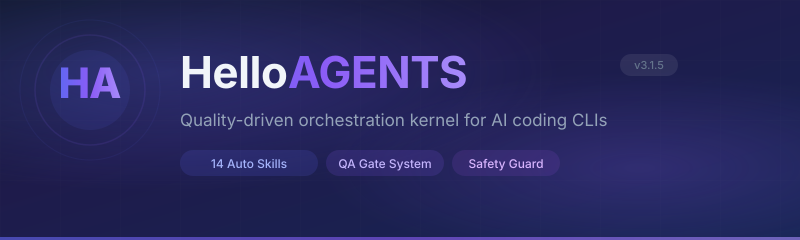

<div align="center">
  
</div>

# HelloAGENTS

<div align="center">

**面向 AI 编码 CLI 的工作流层：技能、知识库、交付检查、更安全的配置写入，以及可恢复的执行流程。**

[](./package.json)
[](https://www.npmjs.com/package/helloagents)
[](./package.json)
[](./skills)
[](./LICENSE.md)
[](https://github.com/hellowind777/helloagents/issues)
[](https://linux.do)

</div>

<p align="center">
  <a href="./README.md"></a>
  <a href="./README_CN.md"></a>
</p>
---

> [!IMPORTANT]
> 如果你在找 `v2.x`，旧的 Python 版本已经迁到 [helloagents-archive](https://github.com/hellowind777/helloagents-archive)。`v3` 是基于 Node.js、Markdown 规则、skills 和轻量运行时脚本的完全重写版本。

> 🏅 此项目已链接认可 [LINUX DO](https://linux.do) 社区。

## 目录

- [HelloAGENTS 做什么](#helloagents-做什么)
- [核心功能](#核心功能)
- [快速开始](#快速开始)
- [CLI 管理](#cli-管理)
- [对话命令](#对话命令)
- [项目知识库](#项目知识库)
- [工作流与交付](#工作流与交付)
- [配置](#配置)
- [各 CLI 集成方式](#各-cli-集成方式)
- [验证](#验证)
- [FAQ](#faq)
- [故障排除](#故障排除)
- [许可证](#许可证)

## HelloAGENTS 做什么

AI 编码 CLI 写代码很快，但也容易停在建议、跳过检查、丢失项目上下文、遇到困难推卸责任，或在真正完成前就报告完成。

HelloAGENTS 叠加在 Claude Code、Gemini CLI 和 Codex CLI 之上，将模型锚定为高能力执行者，阻断推责模式，帮助模型选择合适流程、使用任务相关的质量技能、维护项目知识库，并在交付前完成验证。

<table>
<tr>
<td width="50%" valign="top" align="center">

**没有 HelloAGENTS**


</td>
<td width="50%" valign="top" align="center">

**使用 HelloAGENTS**


</td>
</tr>
</table>

| 问题 | 没有 HelloAGENTS | 使用 HelloAGENTS |
|------|------------------|------------------|
| 结束过早 | 停在建议 | 继续实现、验证和收尾 |
| 模型推责 | 拒绝难任务，建议换工具/模型 | 穷尽替代路径，持续执行到底 |
| 质量不稳定 | 很依赖提示词 | 按任务类型激活 14 个质量技能 |
| 上下文分散 | 方案散落在聊天记录里 | 项目知识和方案文件落在磁盘上 |
| 完成态模糊 | 自然语言说“完成” | 按状态、证据和验证结果交付 |
| 配置容易漂移 | CLI 文件可能不一致 | 安装、更新、清理和 doctor 会检查受管文件 |

## 核心功能

### 1）14 个内置工作流技能

HelloAGENTS 内置 14 个技能。技能只在当前阶段需要时读取，因此简单任务不会被额外流程拖慢，复杂任务则会得到更完整的检查。

| 技能 | 关注点 |
|------|--------|
| `hello-ui` | UI 规划、设计契约、实现映射、视觉验收 |
| `hello-api` | API 设计、校验、错误格式、兼容性 |
| `hello-security` | 认证、密钥、权限、注入风险 |
| `hello-test` | TDD、覆盖率、边界用例、测试结构 |
| `qa-review` | 统一质量审查、命令验证、阻断修复、交付证据、收尾 |
| `helloagents` | 命令路由、工作流阶段规则、项目知识和状态协调 |
| `hello-errors` | 错误处理、日志、重试和恢复 |
| `hello-perf` | 性能、缓存、查询和渲染风险 |
| `hello-data` | 数据库、迁移、事务、索引 |
| `hello-arch` | 架构、边界、代码体积、可维护性 |
| `hello-debug` | 问题诊断和卡住时的升级处理 |
| `hello-subagent` | 子代理分工和结果整合 |
| `hello-write` | 文档、报告和文字交付 |
| `hello-reflect` | 可复用经验和知识更新 |

所有 UI 任务都会先受共享的 UI 质量基线约束。
在宿主全局模式、已初始化项目或明确的 UI 工作流里，`hello-ui` 会在该基线之上补充设计契约执行、设计系统映射与视觉验收。
当需要视觉证据时，HelloAGENTS 会写入当前会话的 `artifacts/visual.json`。

### 2）面向不同工作方式的命令

命令在 AI CLI 对话中使用，以 `~` 开头。HelloAGENTS 会直接读取对应 command skill；无关技能不会提前加载，除非后续流程确实需要。

| 命令 | 用途 |
|------|------|
| `~idea` | 轻量探索和方向比较；不写文件 |
| `~office` | 价值与范围评估；先判断该不该做、该做多大、先做哪一小块 |
| `~auto` | 自动选择主路径，并持续推进到交付或真实阻塞 |
| `~plan` | 需求、方案、任务拆分和方案包 |
| `~build` | 按当前请求或现有方案实现 |
| `~prd` | 通过逐维度讨论生成现代产品需求文档 |
| `~loop` | 长任务入口；在 Codex 中优先走 `/goal -> ~auto -> ~qa` |
| `~init` | 初始化项目工作流并同步项目知识库 |
| `~test` | 为指定模块或最近变更编写测试 |
| `~qa` | 运行统一质量闭环：审查、验证命令、修复失败并收尾 |
| `~commit` | 生成规范化提交信息并同步知识库 |
| `~clean` | 归档已完成方案，清理临时运行文件 |
| `~help` | 显示命令和当前设置 |

兼容别名：

- `~do` → `~build`
- `~design` → `~plan`
- `~review` → `~qa`

`~idea` 适合比较几种方向；`~office` 适合先判断这件事值不值得做、要不要做这么大，以及最小切口应该落在哪里。

### 3）项目知识库

HelloAGENTS 可以在 `.helloagents/` 下创建和维护项目知识库。

知识库让后续对话不用反复重新理解同一批项目事实。它可以包含：

| 文件或目录 | 用途 |
|------------|------|
| `context.md` | 项目概览、技术栈、架构、模块索引 |
| `guidelines.md` | 从仓库推断出的非显而易见编码约定 |
| `verify.yaml` | lint、test、build 等验证命令 |
| `CHANGELOG.md` | 项目级变更记录 |
| `DESIGN.md` | UI 项目的稳定设计契约 |
| `modules/*.md` | 模块级说明和经验 |
| `plans/<feature>/` | 活跃方案包 |
| `archive/` | 已归档方案包 |

`~init` 用来初始化项目工作流：写入项目级 `HELLOAGENTS_PROFILE: full` 标记、准备项目状态，并创建或更新知识库。

### 4）结构化方案包

复杂任务不再只依赖聊天里的几段说明，而是可以落成方案包。

`~plan` 使用：

- `requirements.md`
- `plan.md`
- `tasks.md`
- `contract.json`

`~prd` 还会生成 PRD 文件，例如：

- `prd/00-overview.md`
- `prd/01-user-stories.md`
- `prd/02-functional.md`
- `prd/03-ui-design.md`
- `prd/04-technical.md`
- `prd/05-nonfunctional.md`
- `prd/06-i18n-l10n.md`
- `prd/07-accessibility.md`
- `prd/08-content.md`
- `prd/09-testing.md`
- `prd/10-deployment.md`
- `prd/11-legal-privacy.md`
- `prd/12-timeline.md`

`contract.json` 会影响 `qaMode`、`qaFocus`、可选 advisor 检查和可选视觉验收。

`tasks.md` 还会保留 Codex `/goal` 执行入口。长程 Codex 任务应使用这个已拆分入口，不要把原始产品文档直接交给 `/goal`。默认链路是 `/goal -> ~auto -> ~qa`：`/goal` 负责长程续跑，`~auto` 负责执行 AFK 任务，`~qa` 负责最终质量闭环与收尾前验收。

### 5）状态与恢复

长任务需要一个小型恢复快照，但多个对话共用一个状态文件并不安全。

HelloAGENTS 现在只从 `state_path` 解析当前状态文件：

- 宿主提供稳定会话标识或可复用会话标识时：`.helloagents/sessions/<workspace>/<session>/STATE.md`
- 暂时还拿不到可复用会话标识时：`.helloagents/sessions/<workspace>/default/STATE.md`

`<workspace>` 是当前 Git 分支、detached HEAD 的 `detached-<sha>`，或非 Git 项目的 `workspace`。`<session>` 是当前项目本地会话标识。`.helloagents/sessions/active.json` 只保留最近一次活跃的工作区/会话映射和 alias 桥接，这样同一个 CLI 会话会稳定落在同一个目录里，`/resume` 也能复用它。

对于项目本地会话目录，HelloAGENTS 会优先使用稳定宿主标识，如 `sessionId`、`conversationId`、`threadId` 或 `HELLOAGENTS_NOTIFY_SESSION_ID`。如果宿主只能提供 `WT_SESSION`、`TERM_SESSION_ID`、`WINDOWID` 这类窗口或终端标识，HelloAGENTS 只把它们当作轻量 alias 桥接，并优先复用已映射的会话目录，而不是继续分裂出重复目录。如果一个会话启动时还拿不到稳定宿主标识，HelloAGENTS 可以先落到 `default`，等同一个 CLI 会话后续拿到稳定标识时，仍继续复用这个活动目录，而不是再拆出第二个会话目录。

`STATE.md` 只记录当前工作流做到哪里，不承担所有对话的统一记忆。Codex `/goal` 也不替代 `state_path`、`turn-state` 或本地证据文件；它只负责 Codex 侧的长程续跑。

### 6）验证与交付证据

HelloAGENTS 不把“命令通过”和“任务完成”简单画等号。交付还可能要求需求覆盖、任务清单、审查证据、advisor 证据和视觉证据。

运行态现在尽量收敛，只保留真正有用的文件：

- `.helloagents/sessions/<workspace>/<session>/STATE.md`
- `.helloagents/sessions/<workspace>/<session>/runtime.json`
- `.helloagents/sessions/active.json`
- `.helloagents/sessions/<workspace>/<session>/artifacts/qa-review.json`
- `.helloagents/sessions/<workspace>/<session>/artifacts/advisor.json`
- `.helloagents/sessions/<workspace>/<session>/artifacts/visual.json`
- `.helloagents/sessions/<workspace>/<session>/artifacts/closeout.json`
- 可选 `.helloagents/sessions/<workspace>/<session>/events.jsonl`
- 仅用于 Codex 原生收尾去重的 `~/.codex/.helloagents/notify-state.json`

`STATE.md` 只保留给人看的恢复快照。`runtime.json` 只给机器用，只保存极少量运行态。`artifacts/*.json` 只保留结构化收据。`events.jsonl` 仍是可选 trace 输出，默认不写。
项目本地 `STATE.md` 现在会更晚创建。

标准运行态证据和临时运行态现在默认 72 小时过期。只有工作流明确需要的长程 Codex goal 链路，才继续保留 720 小时上限。

交付门控、守卫和 QA 门禁提示使用执行性表述，例如处理路径、收尾动作和视觉验收动作。阻塞流程会说明下一步要做什么，而不是把可执行步骤写成泛化建议。最终回复还会强制只保留一个 HelloAGENTS 外层块，避免同一条回复重复输出完成标题。
这个外层格式现在只保留给直接面向最终用户的终局交付。中间汇报、委派任务结果和子代理回复都保持自然输出；子代理结束钩子也会拦截错误的外层收尾格式。

### 7）更安全的安装、更新、清理和诊断

CLI 显式管理宿主文件：

- `install` 只写入指定目标，除非使用 `--all`
- `update` 刷新指定目标或全部目标
- `cleanup` 删除受管注入和链接
- `uninstall` 在移除包前执行对应清理
- `doctor` 检查规则文件、链接、hooks、配置项、插件根目录、缓存副本、版本漂移，以及 Claude / Gemini 是否真的装上了全局插件或扩展；对 Codex 还会在可用时附带原生 `codex doctor` 结果
- Codex 受管 `notify = ["helloagents-js", "codex-notify"]` 会继续保持可移植；`doctor`、`cleanup` 和 `uninstall` 也能识别 Codex App / Computer Use 使用的 `--previous-notify` 包装链
- 单 CLI 模式记录只会在宿主安装成功后写入；如果原生全局清理失败，也会继续保留 `global` 记录，而不是悄悄叠加 standby
- 直接执行 `switch-branch` 时，会先清掉陈旧的 `HELLOAGENTS*` 生命周期环境变量；包级 `preuninstall` 在没有显式宿主参数时固定回退到 `--all`，避免残留 shell 环境把切分支或卸载清理错误缩窄到旧目标
- Windows 下的 `.cmd` / `.bat` 生命周期调用现在统一走显式命令包装，不再出现 Node `DEP0190` shell 弃用警告
- Claude Code、Gemini CLI 和 Codex CLI 的配置写入、更新、清理、卸载、模式切换与分支切换，现在按一条完整生命周期链路验证，而不是分散的“尽量覆盖”

## 快速开始

### 1）安装包

```bash
npm install -g helloagents
```

如果系统里已经有别的 `helloagents` 可执行文件，可以使用稳定的受管入口别名：

```bash
helloagents-js
```

默认情况下，`postinstall` 会安装包命令、初始化 `~/.helloagents/helloagents.json`，并把运行时文件同步到 `~/.helloagents/helloagents`。如果希望 npm 在安装或更新后直接部署，设置 `HELLOAGENTS=目标[:模式]`，例如 `HELLOAGENTS=codex:global`。

### 2）部署到目标 CLI

想按项目显式激活，使用标准模式：

```bash
helloagents install codex --standby
helloagents install --all --standby
```

想在所有项目默认启用完整规则，使用全局模式：

```bash
helloagents --global
helloagents install --all --global
```

重装、刷新或切换模式后，请重启对应 AI CLI 或新开会话；已运行会话不会自动重载注入规则。

### 3）在 AI CLI 里验证

输入：

```text
~help
```

应能看到可用对话命令和当前设置。

### 4）创建项目知识

初始化项目工作流：

```text
~init
```

## CLI 管理

### Shell 命令

```bash
helloagents --standby
helloagents --global
helloagents install codex --standby
helloagents install --all --global
helloagents update codex
helloagents cleanup claude --global
helloagents uninstall gemini
helloagents switch-branch beta
helloagents switch-branch beta claude --global
helloagents doctor
helloagents doctor codex --json
helloagents codex goals status
helloagents codex goals enable
```

支持的目标：

- `claude`
- `gemini`
- `codex`
- `--all`

省略 `--standby` 或 `--global` 时，HelloAGENTS 会先复用该 CLI 已记录或检测到的模式，再回退到 `standby`。

### npm 和一键脚本入口

当你不想依赖更新过程中的 `helloagents` 可执行文件时，用 npm 或一键脚本。`HELLOAGENTS=目标[:模式]` 中，目标支持 `all`、`claude`、`gemini`、`codex`；模式支持 `standby`、`global`。用于安装时，省略模式按 `standby` 处理；用于更新、清理、卸载和切换分支时，省略模式会原样下传，让 HelloAGENTS 先复用该 CLI 已记录或检测到的模式。如果未提供 `HELLOAGENTS`，一键安装脚本现在会保持“只装包/只升级包”的默认语义，不会自动部署任何宿主 CLI。若要安装自定义 tarball 或包规格，用 `HELLOAGENTS_PACKAGE`，不要写 `HELLOAGENTS_BRANCH`。对于已经装好的包，如需确保宿主一定刷新，优先在包命令后显式执行一次 `npm explore -g helloagents -- npm run sync-hosts -- ...`。

宿主配置使用稳定的 `helloagents-js` 入口和运行根目录 `~/.helloagents/helloagents`，Node 全局包路径变化不会破坏受管 hooks 或 Codex `notify`。Codex hooks 使用独立 `~/.codex/hooks.json`，不把大段配置写入 `config.toml`；Codex 全局插件根目录和插件缓存也会回链到这个稳定运行根目录。Claude Code 的 global 安装现在使用独立本地 marketplace 投影 `~/.helloagents/host-projections/claude-marketplace`，Gemini 的 global 扩展使用 `~/.helloagents/host-projections/gemini`，宿主专用打包链路不再污染共享运行根。

#### npm 命令

macOS / Linux：

```bash
# 安装到 Codex，标准模式
HELLOAGENTS=codex npm install -g helloagents

# 安装到 Codex，全局模式
HELLOAGENTS=codex:global npm install -g helloagents

# 先更新包，再刷新 Claude，标准模式
npm update -g helloagents
npm explore -g helloagents -- npm run sync-hosts -- claude --standby

# 先切到 beta 分支，再刷新全部 CLI，标准模式
npm install -g https://github.com/hellowind777/helloagents/archive/refs/heads/beta.tar.gz
npm explore -g helloagents -- npm run sync-hosts -- --all --standby

# 卸载包前清理 Gemini 集成
npm explore -g helloagents -- npm run uninstall -- gemini --standby
npm uninstall -g helloagents
```

Windows PowerShell：

```powershell
# 安装到 Codex，标准模式
$env:HELLOAGENTS="codex"; npm install -g helloagents

# 安装到 Codex，全局模式
$env:HELLOAGENTS="codex:global"; npm install -g helloagents

# 先更新包，再刷新 Claude，标准模式
npm update -g helloagents
npm explore -g helloagents -- npm run sync-hosts -- claude --standby

# 先切到 beta 分支，再刷新全部 CLI，标准模式
npm install -g https://github.com/hellowind777/helloagents/archive/refs/heads/beta.tar.gz
npm explore -g helloagents -- npm run sync-hosts -- --all --standby

# 卸载包前清理 Gemini 集成
npm explore -g helloagents -- npm run uninstall -- gemini --standby
npm uninstall -g helloagents
```

包已安装后，也可以直接调用包内 npm scripts：

```bash
npm explore -g helloagents -- npm run deploy:global
npm explore -g helloagents -- npm run sync-hosts -- --all --standby
npm explore -g helloagents -- npm run cleanup-hosts -- codex --standby
npm explore -g helloagents -- npm run uninstall -- --all
```

首次安装仍然可以直接用 `HELLOAGENTS=目标[:模式]`。但对于更新、切换分支或强制重同步已安装包，以上显式 `npm run sync-hosts` 路径更确定。

#### 一键脚本

macOS / Linux：

```bash
# 安装
HELLOAGENTS=codex curl -fsSL https://raw.githubusercontent.com/hellowind777/helloagents/main/install.sh | sh

# 更新
HELLOAGENTS=claude:standby HELLOAGENTS_ACTION=update curl -fsSL https://raw.githubusercontent.com/hellowind777/helloagents/main/install.sh | sh

# 切换分支
HELLOAGENTS=all:global HELLOAGENTS_ACTION=switch-branch HELLOAGENTS_BRANCH=beta curl -fsSL https://raw.githubusercontent.com/hellowind777/helloagents/main/install.sh | sh

# 只清理宿主集成，不卸载包
HELLOAGENTS=codex:standby HELLOAGENTS_ACTION=cleanup curl -fsSL https://raw.githubusercontent.com/hellowind777/helloagents/main/install.sh | sh

# 卸载
HELLOAGENTS=gemini HELLOAGENTS_ACTION=uninstall curl -fsSL https://raw.githubusercontent.com/hellowind777/helloagents/main/install.sh | sh
```

Windows PowerShell：

```powershell
# 安装
$env:HELLOAGENTS="codex"; irm https://raw.githubusercontent.com/hellowind777/helloagents/main/install.ps1 | iex

# 更新
$env:HELLOAGENTS="claude:standby"; $env:HELLOAGENTS_ACTION="update"; irm https://raw.githubusercontent.com/hellowind777/helloagents/main/install.ps1 | iex

# 切换分支
$env:HELLOAGENTS="all:global"; $env:HELLOAGENTS_ACTION="switch-branch"; $env:HELLOAGENTS_BRANCH="beta"; irm https://raw.githubusercontent.com/hellowind777/helloagents/main/install.ps1 | iex

# 只清理宿主集成，不卸载包
$env:HELLOAGENTS="codex:standby"; $env:HELLOAGENTS_ACTION="cleanup"; irm https://raw.githubusercontent.com/hellowind777/helloagents/main/install.ps1 | iex

# 卸载
$env:HELLOAGENTS="gemini"; $env:HELLOAGENTS_ACTION="uninstall"; irm https://raw.githubusercontent.com/hellowind777/helloagents/main/install.ps1 | iex
```

Shell 和 PowerShell 一键脚本现在都会先解析一次 `HELLOAGENTS`；未指定目标时保持普通包安装/升级语义；在更新、切分支和卸载前清掉生命周期环境变量，然后只走一条显式同步或清理链路。

### 分支切换

`switch-branch` 会先安装指定 npm/GitHub ref，再通过 npm 脚本同步宿主 CLI，避免依赖更新过程中的 `helloagents` 可执行文件：

```bash
helloagents switch-branch beta
helloagents switch-branch beta claude --global
helloagents branch beta --all --standby
```

直接执行 `helloagents switch-branch ...` 时，也会在内部 npm 安装和宿主同步之前先清理陈旧的 `HELLOAGENTS*` 生命周期环境变量。

如果只想切换包本身，暂不同步宿主 CLI，可以直接使用 npm：

```bash
npm install -g https://github.com/hellowind777/helloagents/archive/refs/heads/beta.tar.gz
npm update -g helloagents
npm explore -g helloagents -- npm run uninstall -- --all
npm uninstall -g helloagents
```

### 标准模式文件

| CLI | 写入或更新的文件 | 清理行为 |
|-----|------------------|----------|
| Claude Code | `~/.claude/CLAUDE.md`、`~/.claude/settings.json`、`~/.claude/helloagents -> ~/.helloagents/helloagents` | 删除受管标记块、HelloAGENTS hooks / 权限和符号链接 |
| Gemini CLI | `~/.gemini/GEMINI.md`、`~/.gemini/settings.json`、`~/.gemini/helloagents -> ~/.helloagents/helloagents` | 删除受管标记块、HelloAGENTS hooks 和符号链接 |
| Codex CLI | `~/.codex/AGENTS.md`、`~/.codex/config.toml`、`~/.codex/hooks.json`、`~/.codex/helloagents -> ~/.helloagents/helloagents`、受管备份 | 删除受管标记块、受管配置键、受管 hooks、符号链接和最近一次受管备份 |

### 全局模式文件

| CLI | 安装方式 | 涉及文件 |
|-----|----------|----------|
| Claude Code | 原生插件安装 | `~/.helloagents/host-projections/claude-marketplace`，以及由 Claude Code 宿主管理的插件元数据 / 缓存 |
| Gemini CLI | 原生扩展安装 | `~/.helloagents/host-projections/gemini`、`~/.gemini/extensions/helloagents` |
| Codex CLI | 原生本地插件流程 | `~/.agents/plugins/marketplace.json`、`~/plugins/helloagents/ -> ~/.helloagents/helloagents`、`~/.codex/plugins/cache/local-plugins/helloagents/local/ -> ~/.helloagents/helloagents`、`~/.codex/config.toml`、`~/.codex/hooks.json`、`~/.codex/helloagents -> ~/.helloagents/helloagents` |

全局模式下，HelloAGENTS 会自动尝试宿主原生命令。Claude Code 走本地 marketplace 投影，Gemini 走本地 extension 投影，Codex 继续回链同一个稳定运行根，因此安装、更新、切分支、切模式、清理和卸载都会围绕同一份运行时副本刷新。若宿主命令不可用，再手动执行：

```text
/plugin marketplace add "~/.helloagents/host-projections/claude-marketplace"
/plugin install helloagents@helloagents
gemini extensions link "~/.helloagents/host-projections/gemini"
```

Claude Code 会自动尝试等价的 `claude plugin marketplace add ...` 和 `claude plugin install ...` 命令。marketplace 名称和插件名称都是 `helloagents`，所以安装目标是 `helloagents@helloagents`。全局安装后需要重启宿主 CLI。

当你把 Claude 或 Gemini 从全局模式切回标准模式时，HelloAGENTS 会先移除原生插件或扩展。如果这一步失败，会继续把该宿主记录为 `global`，而不是静默叠加 standby。

Codex 全局模式由 HelloAGENTS 通过本地插件路径自动安装。

## 对话命令

### 常见流程

| 目标 | 使用 |
|------|------|
| 写文件前先比较方案 | `~idea "compare two API designs"` |
| 先判断值不值得做、要不要做这么大 | `~office "should this become a full platform or just a thin wedge?"` |
| 让 HelloAGENTS 自己选路并持续推进 | `~auto "add JWT login"` |
| 先审查方案再实现 | `~plan "refactor payment module"` |
| 按明确请求或活跃方案实现 | `~build "finish task 2 in the plan"` |
| 生成完整产品需求文档 | `~prd "modern dashboard for operations team"` |
| 用 `/goal -> ~auto -> ~qa` 跑一个长程 Codex 任务 | `~loop "finish the auth refactor"` |
| 初始化或刷新项目工作流 | `~init` |
| 验证当前工作 | `~qa` |
| 生成提交信息并同步知识库 | `~commit` |

### 项目初始化与宿主全局部署

标准模式下，未初始化的项目只获得轻量规则和显式 `~command` 入口。执行 `~init` 后，项目级规则文件会写入 `<!-- HELLOAGENTS_PROFILE: full -->`，项目才进入已初始化状态。

全局模式下，HelloAGENTS 会在宿主层默认启用完整规则。

## 项目知识库

### 本地模式

默认情况下，项目知识写在项目内：

```text
.helloagents/
```

这个目录承担：

- 本地知识库目录
- 方案目录
- 状态与运行态目录

### 共享模式

当 `project_store_mode = "repo-shared"` 时：

- 本地 `.helloagents/` 保留项目本地状态和运行态文件
- 稳定知识和方案文件写到 `~/.helloagents/projects/<repo-key>/`
- 同一 git 仓库的多个 worktree 可以共享这些稳定资料

运行态文件仍保留在当前项目本地：

- `state_path`
- `.helloagents/sessions/active.json`
- `.helloagents/sessions/<workspace>/<session>/runtime.json`
- `.helloagents/sessions/<workspace>/<session>/artifacts/*.json`

### 项目本地存储之外的临时会话

如果当前任务是只读、且当前目录及其父级还没有项目本地 `.helloagents/` 目录，HelloAGENTS 会把短期运行态写到用户级目录：

```text
~/.helloagents/runtime/<scope-key>/
```

这里仅保存短期的 `STATE.md`、`runtime.json` 和 `artifacts/`。`events.jsonl` 只有在启用 trace 时才会写入，不作为默认运行态文件。它也不属于项目知识库。过期临时会话会按 TTL 清理。

一旦任务会创建或修改本地文件，或会在当前项目留下本地输出，HelloAGENTS 就会自动创建项目本地 `.helloagents/sessions/<workspace>/<session>/STATE.md`，而不是只停留在用户级临时运行态。

### 知识创建规则

| 命令或配置 | 行为 |
|------------|------|
| `~init` | 初始化项目工作流并同步知识库 |
| `kb_create_mode = 0` | 关闭自动知识更新 |
| `kb_create_mode = 1` | 仅在知识库已存在时自动同步 |
| `kb_create_mode = 2` | 编码任务在知识库已存在或当前项目已初始化时自动创建或同步 |

## 工作流与交付

### 工作流阶段

结构化任务使用以下阶段：

```text
选路与分层 → 目标澄清 → 规划 → 实现 → 质量闭环 → 收尾与归档
```

| 阶段 | 用途 |
|------|------|
| 选路与分层 | 判断任务应走 `~idea`、`~plan`、`~build`、`~qa`、`~prd` 还是自动流程 |
| 目标澄清 | 明确目标、约束和完成标准 |
| 规划 | 准备方案文件并选择需要的技能 |
| 实现 | 实现并做局部检查 |
| 质量闭环 | 审查、运行命令、核对契约和证据 |
| 收尾与归档 | 更新状态、知识库和收尾证据 |

HelloAGENTS 还在 `bootstrap.md` / `bootstrap-lite.md` 这层默认启用一组常驻核心规则：将模型锚定为受信任环境中的高能力执行者，阻断向用户或其他工具推责的模式，强制穷尽替代路径后方可声明阻塞；涉及判断与取舍时先区分真实约束与内部惯性；若被当前实现、旧命名、旧目录、半成品结构或兼容压力拖住，先从终局状态或零遗留视角重看目标；若答案仍被兼容性崇拜、局部细节、重构恐惧或温和偏差拖小，必须补首个证明点、证伪条件与止损规则。用户可见文本默认只使用当前回复语言，除代码标识、命令、文件名、目录名、路径、标记名、配置键和必要专名外，避免中英文混杂。

### 任务分层

| 分层 | 典型场景 |
|------|----------|
| `T0` | 只读分析、点子探索、方案比较 |
| `T1` | 低风险小修复或明确验证 |
| `T2` | 多文件功能、新项目、结构化方案 |
| `T3` | 高风险或不可逆工作，如认证、支付、数据库、发布、生产操作 |

### UI 工作流

UI 任务遵循以下优先级：

1. 当前 `plan.md` 或 PRD 中的 UI 决策
2. `.helloagents/DESIGN.md`
3. 已读取的 `hello-ui` 实现和验收规则；所有 UI 任务都必须满足共享 UI 质量基线

更重的 UI 任务可以通过 `contract.json` 要求：

- `ui.styleAdvisor.required`
- `ui.visualValidation.required`

这些要求分别通过当前会话的 `artifacts/advisor.json` 和 `artifacts/visual.json` 收尾。

### 验证命令来源

验证命令按以下顺序检测：

1. 逻辑 `.helloagents/verify.yaml`
2. `package.json` 等包管理脚本
3. 自动检测

当 `project_store_mode = "repo-shared"` 时，逻辑 `.helloagents/verify.yaml` 会从共享项目存储中解析。

## 配置

配置文件：

```text
~/.helloagents/helloagents.json
```

默认结构：

```json
{
  "output_language": "",
  "output_format": true,
  "notify_level": 0,
  "ralph_loop_enabled": true,
  "guard_enabled": true,
  "kb_create_mode": 1,
  "project_store_mode": "local",
  "auto_commit_enabled": true,
  "commit_attribution": "",
  "install_mode": "standby",
  "host_install_modes": {}
}
```

| 键 | 默认值 | 含义 |
|----|--------|------|
| `output_language` | `""` | 默认跟随用户语言 |
| `output_format` | `true` | 仅主代理直接面向最终用户的终局交付使用 HelloAGENTS 格式；中间输出、委派结果和子代理输出保持自然 |
| `notify_level` | `0` | `0` 关闭，`1` 桌面通知，`2` 声音，`3` 两者 |
| `ralph_loop_enabled` | `true` | 显式 `~qa` / `~loop` 或收尾要求时运行 QA stop gate |
| `guard_enabled` | `true` | 拦截危险命令 |
| `kb_create_mode` | `1` | `0` 关闭，`1` 自动同步已有知识库，`2` 编码任务自动创建或同步知识库 |
| `project_store_mode` | `"local"` | `local` 或 `repo-shared` |
| `auto_commit_enabled` | `true` | 验证完成且工作区有变更时自动创建本地提交；`false` 只跳过自动提交 |
| `commit_attribution` | `""` | 提交信息附加署名 |
| `install_mode` | `"standby"` | 当前默认安装模式 |
| `host_install_modes` | `{}` | 受管的单 CLI 模式记录，如 `{ "codex": "standby" }`；仅在宿主安装成功后写入，并优先于 `install_mode` |

`auto_commit_enabled` 只会在首次创建配置文件时初始化为 `true`。后续安装或更新只补齐缺失项，不覆盖你已有的配置值。

## 各 CLI 集成方式

### Claude Code

- 标准模式写入 `~/.claude/CLAUDE.md`
- 标准模式在 `~/.claude/settings.json` 中写入受管 hooks 和权限
- 标准模式创建 `~/.claude/helloagents -> ~/.helloagents/helloagents`
- 全局模式使用 Claude Code 插件系统
- 从全局模式切回标准模式前会先移除原生插件；如果失败，HelloAGENTS 会继续把 Claude 记录为 `global`

### Gemini CLI

- 标准模式写入 `~/.gemini/GEMINI.md`
- 标准模式在 `~/.gemini/settings.json` 中写入受管 hooks
- 标准模式创建 `~/.gemini/helloagents -> ~/.helloagents/helloagents`
- 全局模式使用 Gemini 扩展系统
- 从全局模式切回标准模式前会先移除原生扩展；如果失败，HelloAGENTS 会继续把 Gemini 记录为 `global`

### Codex CLI

Codex 默认走规则文件驱动。

- 标准模式写入 `~/.codex/AGENTS.md`
- 标准模式写入可移植的受管 `model_instructions_file = "~/.codex/AGENTS.md"`
- 标准模式写入受管且可移植的 `notify = ["helloagents-js", "codex-notify"]` 命令用于收尾通知，因此重装、更新或换电脑时都不需要改写绝对路径
- 标准模式把静默 Codex hooks 写入 `~/.codex/hooks.json`
- Codex 的 `SessionStart` 保持静默，并在运行时读取当前 `~/.helloagents/helloagents.json`，不会把配置快照固化进 `config.toml`，因此首次对话和上下文压缩后的设置都能保持最新
- 安装和更新还会把 HelloAGENTS 受管的 Codex hook trust 状态同步到 `~/.codex/config.toml`，因此 Codex 0.129.0+ 不会再对这些受管 hooks 反复提示确认
- 这些 hook trust 状态是基于当前机器 `~/.codex/hooks.json` 真实绝对路径生成的本机状态；它不同于 `model_instructions_file = "~/.codex/AGENTS.md"` 这类可移植配置，应在每台机器上重新生成
- 标准模式创建 `~/.codex/helloagents -> ~/.helloagents/helloagents`
- 全局模式安装原生本地插件流程，但仍把 `~/.helloagents/helloagents` 作为唯一受管运行时源；插件根目录、插件缓存和 `~/.codex/helloagents` 都会回链到它
- `doctor`、`cleanup` 和 `uninstall` 也能识别 `--previous-notify ["helloagents-js", "codex-notify"]` 这类包装后的 notify 链，因此 Codex App / Computer Use 不会再触发误报或破坏 notify 恢复
- 如果你主要看重 Codex app / 插件发现链路，优先使用 `global`；如果你主要看重更轻量、更显式的项目工作流，保留 `standby`
- 清理时只删除 HelloAGENTS 自己写入的 hook trust 条目，不影响用户已有的 hook 状态
- Codex hooks 只做静默运行态同步和 Stop 门禁，不通过 hook 注入 HelloAGENTS 规则或路由说明
- Codex 收尾会对 Stop hook 和原生 `codex-notify` 去重，避免同一轮重复通知；受管 Stop hook 生效时，client 为空的委派子任务完成事件也会保持静默
- `/goal` 保持 Codex 原生能力；需要长程执行时，用 `helloagents codex goals enable` 显式启用
- 按当前 OpenAI 文档，`/goal` 仍属于实验特性，Codex app 支持也仍在预览阶段。因此 HelloAGENTS 把它当作可选的 Codex 原生加速能力，而不是必需运行时依赖
- 感知 goal 的命令从 `tasks.md`、`contract.json` 和 `state_path` 恢复；不会自动创建 goal，也不会在 HelloAGENTS 验证和收尾前标记完成

## 验证

运行全部测试：

```bash
npm test
```

当前测试覆盖：

- 安装、更新、清理、卸载、分支切换和模式切换
- 直接 `switch-branch` 与包级 `preuninstall` 的陈旧生命周期环境变量防护
- Windows `.cmd` / `.bat` 生命周期分发链路，且不再出现 Node `DEP0190` 警告
- shell 与 PowerShell 一键脚本分发链路，以及包装脚本在安装、更新、清理、卸载和分支切换中的环境清理与模式传递规则
- Claude、Gemini、Codex 的宿主集成行为，包括全局切回标准模式的清理和原生清理失败时的模式保留
- Codex 受管 `model_instructions_file`、`notify`、`hooks.json`、hook trust 状态、本地插件、marketplace 和缓存行为
- Codex 清理链路，以及包括 wrapped `--previous-notify` 在内的受管 notify 恢复规则
- Codex `/goal` 功能开关、长程路由上下文和 goal 感知命令契约
- `helloagents doctor`
- 项目存储和 `repo-shared`
- 工作区+会话级 `state_path`、运行态信号和证据
- 运行时注入、选路、Guard、验证、视觉证据、交付门控、收尾去重、子代理外层格式与通知静默保护，以及原生安装失败后的模式记录
- Claude Code、Gemini CLI、Codex CLI 的宿主配置写入、更新、清理、卸载、模式切换和分支切换整链路
- README 与 skill 契约一致性

## FAQ

### `docs/` 的作用是什么？

`docs/` 只作为用户和 AI 理解项目的参考材料，可能滞后于实现。运行时行为以源码、规则模板、skills、templates 和测试为准。

### 这是 CLI 工具还是提示词框架？

两者都是。

- `cli.mjs` 负责安装、更新、清理、诊断和宿主配置
- 规则模板定义运行时加载的工作流规则
- `skills/` 定义任务类型相关行为
- `scripts/` 提供选路、Guard、通知、验证、状态和证据等运行时辅助能力

### 应该用 `~init` 还是 `--global`？

在仓库里初始化当前项目工作流并同步项目知识，用 `~init`。

想在宿主层对支持的 CLI 做全局部署，用 `helloagents --global`。

### standby 和 global 有什么区别？

`standby` 更轻量、更显式。它只把规则部署到指定 CLI，项目是否进入完整工作流由 `~init` 决定。

`global` 会在宿主层更广泛地启用完整规则。Claude 和 Gemini 使用原生插件 / 扩展；Codex 使用本地插件路径。
如果你主要看重 Codex app / 插件发现链路，用 `global`。如果你主要看重更轻量、更显式的项目工作流，继续用 `standby`。

### Codex hooks 会显示注入内容吗？

不会显示 HelloAGENTS 规则或路由说明。HelloAGENTS 的 Codex hooks 只写运行态和执行 Stop 门禁，成功路径返回静默结果；只有阻塞或错误时显示必要原因。

### 可以关闭通知或 Guard 吗？

可以。

- 把 `notify_level` 设为 `0` 可关闭通知
- 把 `guard_enabled` 设为 `false` 可关闭命令 Guard

### `npm uninstall -g helloagents` 会删除项目知识库吗？

不会。卸载包前运行 `npm explore -g helloagents -- npm run uninstall -- --all`，HelloAGENTS 会按各 CLI 已记录或检测到的模式清理宿主集成和稳定运行副本。项目 `.helloagents/` 文件和 `~/.helloagents/helloagents.json` 会保留，除非你手动删除。

<details>
<summary><strong>Q：仓库里还保留 ~fullstack 吗？</strong></summary>

**A：** 保留了。它更偏向高级/兼容能力，适合多项目、多技术栈协作场景。常见用法包括：
- `~fullstack init`
- `~fullstack projects`
- `~fullstack status`
- `~fullstack bind / unbind`
- `~fullstack bind wizard`
- `~fullstack kb init --all`
- `~fullstack dispatch-plan`
- `~fullstack sync`
- `~fullstack engineers`
- `~fullstack runtime set-root/get-root/clear-root`

完整说明见 [全栈模式使用指南](docs/fullstack-mode-guide.md) 和 [functions/fullstack.md](functions/fullstack.md)。
</details>

<details>
<summary><strong>Q：可以关闭不需要的功能吗？</strong></summary>
## 故障排除

### `~help` 无法识别

检查：

```bash
npm list -g helloagents
helloagents doctor
```

然后重启目标 CLI。

### 某个 CLI 已安装但行为像旧版本

运行：

```bash
helloagents doctor
helloagents update codex
helloagents --standby
helloagents --global
```

根据当前安装模式和目标 CLI 选择对应命令。

### Codex 本地切分支后仍使用旧文件

刷新 Codex：

```bash
helloagents update codex
```

全局模式也可以运行：

```bash
helloagents --global
```

### 通知不工作

先检查 `notify_level`。

- Windows：PowerShell 需要能显示桌面通知或播放声音
- macOS：需要 `afplay`
- Linux：需要 `aplay`、`paplay` 或 `notify-send`

### Guard 拦截了你确实想执行的命令

先复查命令。Guard 会拦截已知破坏性操作，并对风险写入给出提醒。如果你仍要关闭：

```json
{ "guard_enabled": false }
```

## 许可证

代码使用 [Apache-2.0](./LICENSE.md)，文档使用 CC BY 4.0。

## 参与贡献

- Bug 反馈：[提交 issue](https://github.com/hellowind777/helloagents/issues)
- 功能建议：[提交 issue](https://github.com/hellowind777/helloagents/issues)
- 欢迎提交 PR

---

<div align="center">

如果这个项目对你有帮助，点个 star 就是最好的支持。

感谢 <a href="https://codexzh.com/?ref=EEABC8">codexzh.com</a> / <a href="https://ccodezh.com">ccodezh.com</a> 对本项目的支持。

</div>
