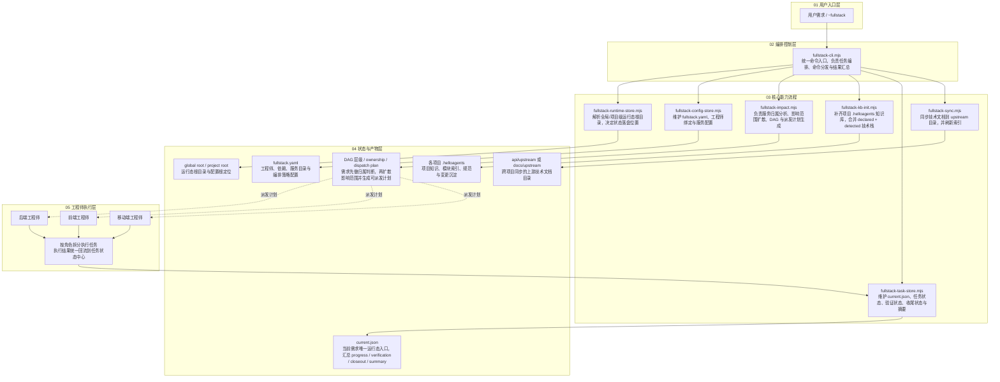
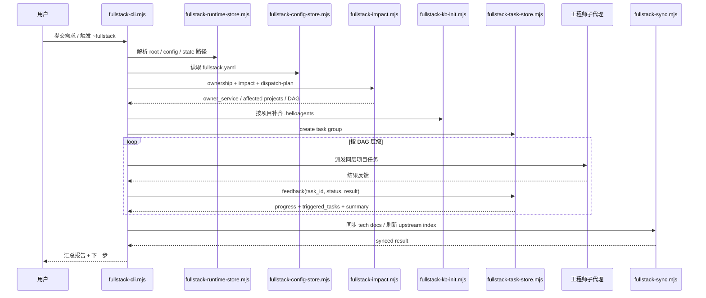

# HelloAGENTS 全栈模式设计文档

> 文档类型：架构与设计说明（可对外分享）  
> 版本：v2.0  
> 状态：与当前 Node.js/ESM 实现对齐

## 1. 背景与目标

### 1.1 背景

一个真实需求经常会同时影响多个项目，例如：

- Web 前端
- BFF / Node 服务
- Java / Python / Go 后端服务
- iOS / Android / 鸿蒙客户端

如果仍按单项目、单代理、串行任务来处理，会持续遇到这些问题：

- 需求先落到哪个项目不清楚，服务归属容易误判
- 多项目依赖难以在一个视角里表达
- 上游完成后，下游何时可以启动缺少统一状态入口
- 技术文档同步依赖人工提醒，容易滞后
- 多项目同时开发时，项目内 runtime 容易和 Git 工作树互相干扰

全栈模式（`~fullstack` / `helloagents fullstack ...`）的目标，就是在不破坏普通模式的前提下，为多项目协作补上一层“服务归属分析 + 影响扩散 + DAG 派发 + 运行态汇总 + 文档同步”的编排能力。

### 1.2 目标

- 支持工程师角色与项目绑定
- 支持基于 `service_catalog` 的服务归属分析
- 支持跨项目依赖分析与拓扑层级调度
- 支持按项目生成可派发任务契约，而不是只派自然语言
- 支持通过单个运行态文件追踪当前需求全过程
- 支持必需交付物、验证状态、收尾状态统一汇总
- 支持项目知识库自动补齐与初始化
- 支持技术文档向依赖项目同步

### 1.3 非目标

- 不替代 `~auto / ~plan / ~exec` 的通用工作流
- 不把所有项目状态长期沉淀成多份 runtime 历史
- 不引入跨工程师共享上下文记忆
- 不改变非全栈模式默认行为

## 2. 当前实现概览

当前 fullstack 已完成从旧 Python 内核到 Node.js/ESM 的迁移，真实实现以这些脚本为核心：

- `scripts/fullstack-cli.mjs`
- `scripts/fullstack-runtime-store.mjs`
- `scripts/fullstack-config-store.mjs`
- `scripts/fullstack-impact.mjs`
- `scripts/fullstack-task-store.mjs`
- `scripts/fullstack-kb-init.mjs`
- `scripts/fullstack-sync.mjs`
- `scripts/fullstack-migrate.mjs`

这意味着全栈模式现在的核心事实是：

- CLI 入口、配置、运行态、任务状态、KB 初始化、文档同步都已经统一在 Node.js 中
- 运行态不再分散在多个状态文件里，`current.json` 是唯一当前需求入口
- 存储模型支持“全局优先，项目内兜底”
- 派发计划、服务归属、影响分析、跨项目依赖分析都由 `fullstack-impact.mjs` 输出

## 3. 系统边界与设计原则

### 3.1 系统边界

输入：

- 用户需求
- `fullstack.yaml`
- 项目代码、项目知识库、上游技术文档

输出：

- 服务归属判断
- 影响范围
- DAG 派发计划
- 任务组运行态
- 技术文档同步结果

存储：

- 全局配置：`~/.helloagents/helloagents.json`
- 全局 fullstack 根：`~/.helloagents/fullstack`
- 全局配置文件：`FULLSTACK_CONFIG_ROOT/fullstack.yaml`
- 全局索引：`FULLSTACK_INDEX_ROOT/*`
- 运行态：`FULLSTACK_RUNTIME_ROOT/{project_runtime_key}/fullstack/tasks/current.json`
- legacy 兜底配置：`{KB_ROOT}/fullstack/fullstack.yaml`
- legacy 兜底运行态：`{KB_ROOT}/fullstack/tasks/current.json`
- 项目知识库：`{project}/.helloagents/*`

### 3.2 设计原则

- 配置优先：先信显式配置，再做轻量推断
- 全局优先：支持把运行态和配置移出项目工作树，减少 Git 干扰
- 单入口运行态：当前需求只保留一份 `current.json`
- 契约先行：派发前生成 task contract，明确验证和交付要求
- 拓扑驱动：层间串行、层内并行
- 反馈闭环：反馈一次就更新状态、验证、收尾、artifact 与下游触发
- 文档同频：跨项目依赖变化必须可同步、可追踪
- 兼容落地：保留 legacy 项目内路径兜底与迁移能力

## 4. 总体架构

## 5. 核心组件设计

### 5.1 CLI 编排入口：`scripts/fullstack-cli.mjs`

职责：

- 解析 `helloagents fullstack ...`
- 负责 runtime / init / migrate / impact / dispatch / task status / sync / kb 等子命令分发
- 统一输出 JSON 或文本结果
- 不承载复杂领域逻辑，领域计算下沉到 store / impact / sync 模块

当前支持的命令分组：

- `runtime`
- `migrate`
- `init`
- `projects`
- `engineers`
- `bind`
- `unbind`
- `impact`
- `dispatch-plan`
- `cross-deps`
- `ownership`
- `create`
- `status`
- `next-layer`
- `start`
- `complete`
- `fail`
- `retry`
- `feedback`
- `report`
- `sync`
- `kb`

### 5.2 运行态与路径解析：`scripts/fullstack-runtime-store.mjs`

职责：

- 管理全栈根目录模式：`project` / `global`
- 计算 `project_runtime_key`
- 解析 runtime/config/index 三类目录
- 处理 `choose-root / set-root / get-root / clear-root`
- 决定当前应该使用全局路径还是 legacy 项目内路径

关键行为：

- `HELLOAGENTS_FULLSTACK_RUNTIME_ROOT` 环境变量优先于全局配置
- `FULLSTACK_ROOT_MODE=global` 时默认把 runtime 放到 `~/.helloagents/fullstack`
- 未配置全局 root 时，运行态回退到 `{KB_ROOT}/fullstack/tasks`
- `resolveFullstackConfigFile` 遵循“显式环境变量 > 全局配置文件 > legacy 项目内配置”的思路

### 5.3 配置存储：`scripts/fullstack-config-store.mjs`

职责：

- 读写 `fullstack.yaml`
- 生成默认配置模板
- 校验配置结构
- 维护工程师列表和项目绑定关系
- 提供 `service_catalog`、`service_dependencies`、项目 owner 查询能力

默认配置聚焦这些结构：

- `engineers[]`
- `service_dependencies`
- `service_catalog`
- `orchestrator`
- `tech_doc_templates`

### 5.4 服务归属与影响分析：`scripts/fullstack-impact.mjs`

职责：

- 聚合所有已绑定项目
- 结合 KB 内容推断项目能力摘要
- 基于 `service_catalog` 分析 owner service
- 计算上下游依赖和影响扩散
- 生成 DAG 层级与派发计划

核心能力：

- `analyzeServiceOwnership`
- `analyzeImpact`
- `analyzeCrossProjectDependencies`
- `buildDispatchPlan`

设计要点：

- `service_catalog` 是第一事实来源
- KB 推断只作为低置信度补充，不替代显式声明
- 未绑定项目不会阻断整体执行，只会出现在 `unassigned_projects` 与 warning 中
- 派发计划只对 `dispatchable_projects` 继续推进

### 5.5 任务运行态：`scripts/fullstack-task-store.mjs`

职责：

- 创建 task group
- 维护任务状态推进
- 维护验证状态与收尾状态
- 维护必需 artifact 骨架与校验结果
- 生成适合恢复与人工接管的 summary

关键事实：

- `current.json` 是唯一当前需求状态文件
- fullstack runtime 不保留多条并行历史状态，只保留“当前这一条需求”
- 状态写入时会同步刷新：
  - `progress`
  - `verification`
  - `closeout`
  - `artifact_status`
  - `summary`

### 5.6 项目知识库初始化：`scripts/fullstack-kb-init.mjs`

职责：

- 识别项目技术栈
- 合并 declared + detected tech stack
- 补齐项目 `.helloagents/` 核心文件
- 兼容 legacy / 半成品 KB
- 从 README / AGENTS / CLAUDE 等参考文档里抽取轻量事实

补齐的核心知识文件包括：

- `INDEX.md`
- `context.md`
- `guidelines.md`
- `CHANGELOG.md`
- `modules/_index.md`

### 5.7 技术文档同步：`scripts/fullstack-sync.mjs`

职责：

- 将上游技术文档复制到依赖项目
- 为同步文件写入来源与同步时间元信息
- 刷新目标项目 upstream 索引

同步目标目录：

- API 类文档：`.helloagents/api/upstream`
- 其他文档：`.helloagents/docs/upstream`

## 6. 配置与目录模型

### 6.1 全局配置

全局配置文件：

- `~/.helloagents/helloagents.json`

其中和 fullstack 相关的关键键包括：

- `FULLSTACK_ROOT_MODE`
- `FULLSTACK_RUNTIME_ROOT`
- `FULLSTACK_CONFIG_ROOT`
- `FULLSTACK_INDEX_ROOT`

### 6.2 fullstack 配置文件优先级

当前代码逻辑下，配置文件解析优先级可概括为：

1. `HELLOAGENTS_FULLSTACK_CONFIG_FILE`
2. `FULLSTACK_CONFIG_ROOT/fullstack.yaml`
3. `{KB_ROOT}/fullstack/fullstack.yaml`

其中：

- 如果 root mode 被设置为 `project`，优先直接走 legacy 项目内配置
- 如果全局 config 文件已存在，或全局 runtime root 已被配置，则优先走全局 config

### 6.3 运行态目录

全局模式：

`FULLSTACK_RUNTIME_ROOT/{project_runtime_key}/fullstack/tasks/current.json`

项目内模式：

`{KB_ROOT}/fullstack/tasks/current.json`

### 6.4 索引与迁移目录

- 配置目录：`FULLSTACK_CONFIG_ROOT`
- 索引目录：`FULLSTACK_INDEX_ROOT`
- 默认全局根：`~/.helloagents/fullstack`

## 7. 关键数据模型

### 7.1 配置模型

核心字段：

- `version`
- `mode`
- `engineers[]`
- `service_dependencies`
- `service_catalog`
- `orchestrator`
- `tech_doc_templates`

其中：

- `engineers[]` 定义工程师身份、类型、项目列表
- `service_dependencies` 定义项目间依赖
- `service_catalog` 定义服务职责、能力、边界与入口

### 7.2 任务契约模型

派发计划中的 assignment 会包含 `task_contract`，典型信息包括：

- `verify_mode`
- `risk_level`
- `reviewer_focus`
- `tester_focus`
- `required_artifacts`
- `upstream_projects`
- `downstream_projects`
- `upstream_contracts`

设计目的：

- 派发前就明确验证方式
- 派发前就明确交付物
- 主代理可以基于契约而不是口头约定做状态判断

### 7.3 运行态模型

`current.json` 的主干结构包括：

- `task_group_id`
- `requirement`
- `status`
- `progress`
- `verification`
- `closeout`
- `execution_layers`
- `tasks`
- `required_artifacts`
- `artifact_scaffold`
- `artifact_status`
- `tech_docs_synced`
- `summary`

### 7.4 必需产物模型

当前默认要求的三件套为：

- `fullstack/docs/tasks.md`
- `fullstack/docs/agents.md`
- `fullstack/docs/upstream.md`

如果这些产物缺失：

- 创建 task group 时会先 scaffold
- 运行态会在 `artifact_status` 中标出 `missing / scaffolded / verified`
- 在完成态下若仍缺失，会把 `summary.next_step` 指向“先补齐 fullstack 必需产物，再进入统一收尾”

## 8. 状态机设计

### 8.1 任务状态

任务级状态：

- `pending`
- `in_progress`
- `completed`
- `partial`
- `failed`
- `blocked`
- `skipped`

状态推进规则：

- `startTask`：`pending -> in_progress`
- `completeTask(..., 'completed')`：`in_progress -> completed`
- `completeTask(..., 'partial')`：`in_progress -> partial`
- `failTask`：`in_progress -> failed`
- 上游失败：下游 `pending / in_progress -> blocked`
- `retryTask`：`failed -> pending`，最多 3 次

### 8.2 任务组状态

任务组整体状态来自 `updateProgress()` 聚合：

- 全部完成：`completed`
- 存在进行中：`in_progress`
- 全部结束但有失败：
  - 有已完成任务：`partial`
  - 无已完成任务：`failed`
- 仅剩阻塞：`blocked`
- 初始：`pending`

### 8.3 验证与收尾状态

每个任务独立维护：

- `verification_status`
  - `pending`
  - `passed`
  - `needs_attention`
- `closeout_status`
  - `pending`
  - `ready`
  - `needs_attention`

这让系统能区分：

- 代码做完但验证未过
- 验证通过但交付物没补齐
- 任务完成且可进入统一收尾

## 9. DAG 调度模型

### 9.1 层级生成

`computeExecutionLayers()` 会基于 `depends_on` 生成拓扑层级：

- 同层任务可并发
- 下一层必须等待依赖层完成
- 如果出现环，会把剩余节点收敛到一层，并标记 `note: circular_dependency_detected`

### 9.2 下游触发

只有在 `processFeedback(taskId, 'completed', result)` 成功后，才会尝试触发 ready 的下游任务。

规则：

- 只有依赖全部 `completed / skipped` 的任务才算 ready
- `partial` 不会自动触发下游
- `failed` 会触发 downstream blocked

### 9.3 派发计划

`buildDispatchPlan()` 的关键输出包括：

- `assignments`
- `dispatchable_projects`
- `unassigned_projects`
- `grouped_by_engineer_type`
- `dispatch_execution_order`
- `warnings`

设计含义：

- 允许有未绑定项目
- 只要仍有可派发项目，就继续执行
- 未绑定项目只作为 advisory warning，不是阻断错误

## 10. 端到端执行流程

## 11. 运行态恢复与人工接管

当前实现不依赖多份历史 runtime，而是依赖 `summary` 字段提供“当前需求快照”。

`summary` 重点包含：

- `requirement`
- `overall_status`
- `current_layer`
- `completed_projects`
- `pending_projects`
- `blocked_tasks`
- `missing_artifacts`
- `next_step`

它的价值是：

- 主代理可快速恢复当前需求状态
- 人工接管时能直接看到剩余工作和阻塞点
- 即使任务组整体完成，也能继续检查是否还缺必需产物

## 12. 项目知识库策略

全栈模式不会深度扫描整个项目，而是优先采用“用户声明 + 轻量事实补充”的方式初始化 KB。

初始化阶段会综合这些信息源：

- 绑定时显式传入的描述与 tech stack
- `package.json` / `pom.xml` / `go.mod` / `requirements.txt` 等结构化文件
- `README.md` / `AGENTS.md` / `CLAUDE.md` / `docs/README.md`

目标不是产出完美百科，而是快速补齐能支撑全栈派发的最低事实：

- 这个项目是什么
- 它使用什么技术栈
- 谁负责它
- 它和谁上下游相连

## 13. 技术文档同步策略

技术文档同步由 `fullstack-sync.mjs` 负责，当前实现关注两件事：

1. 把文件拷贝到目标项目 upstream 目录
2. 给同步结果补上可追踪元信息

元信息包含：

- `同步自`
- `同步时间`
- `文档类型`

同步完成后，还会刷新目标项目的 `_index.md`，方便人工追踪来源和时效。

## 14. 迁移与兼容性

当前代码同时支持：

- 新的全局根目录模式
- 旧的项目内 legacy 模式
- legacy -> global 的迁移与回滚

对应能力由 `scripts/fullstack-migrate.mjs` 提供：

- `dry-run`
- `to-global`
- `rollback`

这让团队可以逐步把：

- `fullstack.yaml`
- `current.json`
- index 数据

从项目工作树迁移到用户级全局目录，而不需要一次性切换所有项目。

## 15. 安全性与可靠性

当前设计里的可靠性保障主要来自这些点：

- 所有配置和状态统一用 UTF-8 读写
- YAML 解析具备 fallback，不强依赖复杂解析器
- 运行态与配置路径有显式优先级，不靠隐式猜测
- 循环依赖不会让分析阶段直接崩溃，而是显式标记出来
- 缺失 artifact、验证未通过、收尾未就绪都能在 runtime 中直接体现

## 16. 与普通模式的关系

全栈模式是 HelloAGENTS 的一层编排扩展，不是替代品。

它和普通模式的边界是：

- 普通模式擅长单项目内的方案、实现、验证
- 全栈模式擅长跨项目的服务归属、派发、汇总与同步

因此推荐心智模型是：

- 项目内怎么做，仍由各项目自己的 `~auto / ~plan / ~exec` 负责
- 哪些项目该参与、先做谁、谁依赖谁、文档怎么同步，由 fullstack 负责

## 17. 评审清单

建议按以下顺序评审这套设计是否与代码一致：

1. 是否明确写清了 Node.js/ESM 已经是当前唯一 fullstack 主实现。
2. 是否明确写清了 `current.json` 是唯一当前需求运行态入口。
3. 是否明确写清了全局优先、项目内兜底的配置与 runtime 路径。
4. 是否明确写清了 `service_catalog -> ownership -> impact -> dispatch-plan` 这条分析链。
5. 是否明确写清了三份必需文档：`tasks.md`、`agents.md`、`upstream.md`。
6. 是否明确写清了 artifact / verification / closeout 三类汇总状态。
7. 是否明确写清了未绑定项目只告警、不阻断可派发项目执行。
8. 是否明确写清了 KB 初始化是轻量事实补全，不是深度扫描。
9. 是否明确写清了技术文档同步与 upstream index 刷新逻辑。
10. 是否明确写清了 migrate / rollback 与 legacy 兼容边界。

## 18. 术语表

| 术语 | 说明 |
|------|------|
| Fullstack Root Mode | fullstack 存储模式，取值为 `project` 或 `global` |
| Runtime Root | 全栈运行态根目录 |
| Config Root | 全栈配置目录 |
| Index Root | 全栈索引目录 |
| project_runtime_key | 由项目绝对路径稳定计算出的运行态目录 key |
| owner service | 被判定为最应承载当前需求的项目/服务 |
| dispatchable project | 已绑定工程师、可真正参与派发的项目 |
| unassigned project | 未绑定工程师、仅告警不派发的项目 |
| task contract | 派发时附带的验证/交付约束 |
| artifact_status | 必需文档与交付物的存在性和验证状态汇总 |
| verification | 任务组级验证状态汇总 |
| closeout | 任务组级收尾状态汇总 |
| summary | 当前需求的恢复与接管摘要 |
| upstream sync | 技术文档向依赖项目同步的过程 |
