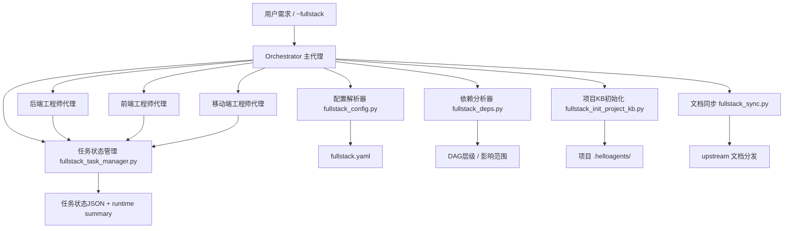
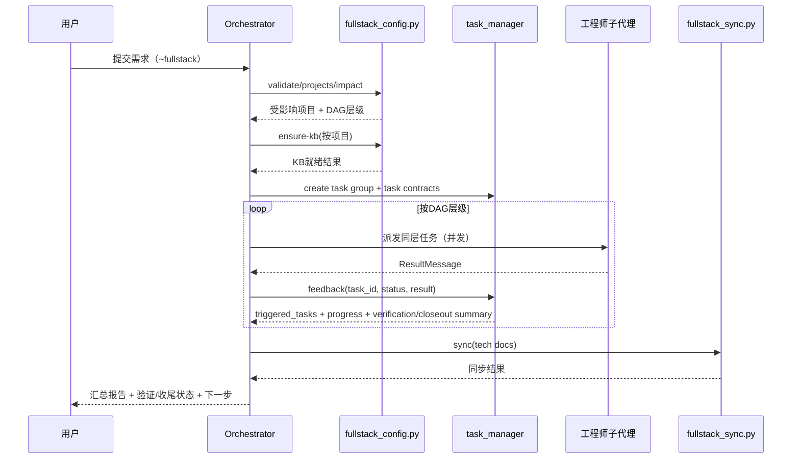
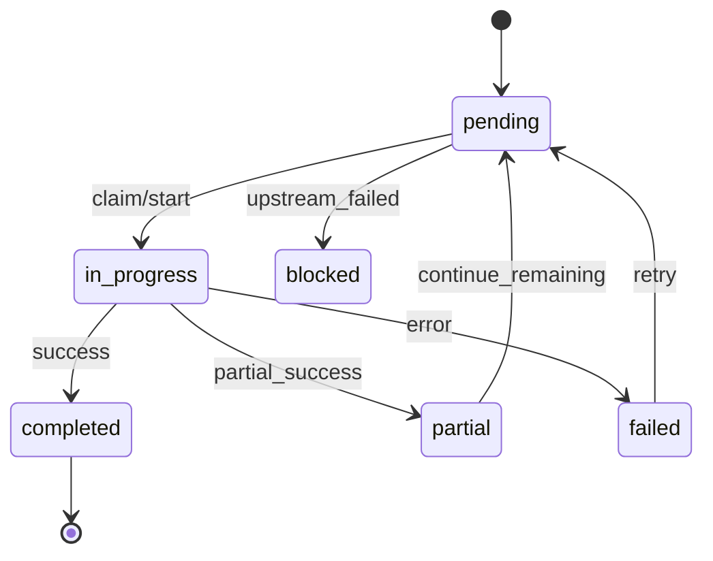

# HelloAGENTS 全栈模式设计文档

> 文档类型：架构与设计说明（可对外分享）
> 版本：v1.1
> 状态：可评审

## 1. 背景与目标

### 1.1 背景

在跨前后端/多服务协作场景中，单代理串行执行容易出现以下问题：

- 需求拆解粒度不一致，任务边界模糊
- 多项目依赖关系难以统一调度
- 状态反馈不及时，无法自动触发下游任务
- 技术文档与代码演进不同步

全栈模式（`~fullstack`）的目标是：在保持 HelloAGENTS 原有工作流一致性的前提下，提供面向多项目协同的统一编排能力，并逐步对齐 `v3.0.7` 主线中的“契约驱动、验证闭环、状态恢复”设计。

### 1.2 目标

- 支持项目与工程师角色绑定（前端/后端/移动端）
- 支持跨项目依赖分析与 DAG 拓扑调度
- 支持基于任务契约的派发（而不是只派发自然语言任务）
- 支持任务状态实时反馈与自动触发下游任务
- 支持任务组级别的验证状态、收尾状态和恢复摘要
- 支持项目级知识库自动检查与初始化
- 支持后端技术文档跨项目同步

### 1.3 非目标

- 不替代现有 `~auto/~plan/~exec` 通用流程
- 不引入跨工程师共享记忆（保持单向通信）
- 不改变非全栈模式默认行为

## 2. 系统边界与设计原则

### 2.1 系统边界

- 输入：用户需求、`fullstack.yaml` 配置（支持全局优先、项目内兜底）、项目代码与文档
- 输出：任务拆解结果、执行进度、变更与技术文档同步结果
- 存储：
  - 项目级：各项目 `.helloagents/`（项目知识库与项目任务）
  - 全局优先：`~/.helloagents/fullstack/config/fullstack.yaml`、`~/.helloagents/fullstack/index/*`
  - 兼容兜底：`{KB_ROOT}/fullstack/fullstack.yaml`
  - 显式设置 `FULLSTACK_RUNTIME_ROOT` 时：配置/索引/运行态统一落在该根目录下，其中任务状态为 `FULLSTACK_RUNTIME_ROOT/{project_hash}/fullstack/tasks/*`

### 2.2 设计原则

- 配置优先：优先使用显式配置，自动识别只做补充
- 拓扑驱动：以依赖关系决定执行层级
- 反馈闭环：每次任务反馈都能更新状态并触发下游
- 最小侵入：不影响非全栈模式已有流程
- 文档同频：接口/设计变更必须可同步到依赖方
- 契约先行：任务派发时同步给出 verify / review / closeout 约束
- 状态可恢复：任务状态不仅能统计进度，也能支撑恢复执行与人工接管

## 3. 总体架构

## 4. 核心组件设计

### 4.1 Orchestrator（主代理）

职责：

- 需求分析与受影响项目识别
- 任务拆解与依赖关系构建
- 任务契约生成（verify / reviewer / tester / deliverables）
- 分层并发派发与结果汇总
- 状态更新与下游触发
- 技术文档同步决策

### 4.2 配置解析器（`fullstack_config.py`）

提供能力：

- 配置校验：`validate`
- 项目列表：`projects`
- 影响分析：`impact`
- 派发契约生成：`build_dispatch_plan`
- 工程师自动识别：`detect-engineer`
- 跨项目依赖分析：`cross-deps`
- 项目 KB 检查与初始化：`ensure-kb`

### 4.3 依赖分析器（`fullstack_deps.py`）

- 读取 `service_dependencies`
- 输出跨项目上下游关系
- 输出拓扑执行层级
- 检测循环依赖

### 4.4 任务状态管理器（`fullstack_task_manager.py` / `fullstack_state.py`）

- 创建任务组与执行层级
- 任务状态流转（pending/in_progress/completed/failed/blocked）
- 任务验证状态流转（pending/passed/needs_attention）
- 任务收尾状态流转（pending/ready/needs_attention）
- 工程师反馈处理（`feedback`）
- 进度报告（`report`）
- 下游任务触发
- runtime summary 生成（供恢复执行与人工接管）

### 4.5 项目知识库初始化器（`fullstack_init_project_kb.py`）

- 检查目标项目 `.helloagents` 是否存在
- 合并 declared + detected 技术栈
- 选择模板并生成/修复项目 KB 初始结构
- 识别“只有历史记录、缺少项目文档”的半成品 KB，保留历史数据并补齐核心知识文档
- 为每个项目生成一个面向对应工程师的独立会话补全文档任务

### 4.6 文档同步器（`fullstack_sync.py`）

- 读取源文档（如 API 契约）
- 按规则分发到依赖项目的 upstream 目录
- 记录同步结果

## 5. 关键数据模型

### 5.1 配置模型（简化）

- `engineers[]`: 工程师定义、技术栈与项目绑定
- `service_dependencies`: 项目依赖图
- `orchestrator`: 并行策略、文档同步策略等

### 5.2 消息模型

- `TaskMessage`: 主代理派发任务（含 `role_activation`）
- `TaskContract`: 派发时附带的轻量契约（verify_mode / reviewer_focus / tester_focus / deliverables）
- `ResultMessage`: 工程师反馈结果（含 `self_review`、`kb_updates`、`tech_docs`）

### 5.3 状态模型

- `task_group_id`
- `execution_layers`
- `tasks{}`
- `progress{}`
- `verification{}`
- `closeout{}`
- `summary{}`
- `tech_docs_synced[]`

## 6. 端到端执行流程

## 7. 状态机设计

## 8. 调度与并发策略

- 层间串行：前一层未完成，不进入下一层
- 层内并行：同层任务并发派发（受并发上限约束）
- 失败传播：上游失败可将下游标记 `blocked`
- 反馈驱动：每次反馈都触发“状态更新 + 下游评估”

## 9. 契约与验证设计

### 9.1 任务契约

全栈模式在 `dispatch_plan.assignments[]` 中为每个可派发项目生成轻量契约，典型字段包括：

- `verify_mode`
- `risk_level`
- `reviewer_focus`
- `tester_focus`
- `deliverables`
- `upstream_projects`
- `downstream_projects`
- `upstream_contracts`

它的作用不是替代详细方案，而是让主代理和工程师子代理在派发时就知道：

- 这个任务要如何验证
- 审查重点放在哪
- 测试重点放在哪
- 需要交付哪些结果

### 9.2 验证与收尾状态

任务组状态除了传统 `progress` 外，额外维护：

- `verification`
  - `pending`
  - `passed`
  - `needs_attention`
- `closeout`
  - `pending`
  - `ready`
  - `needs_attention`

这样任务组汇总时，主代理不只知道“有没有做完”，还知道：

- 哪些项目代码做完但验证未完成
- 哪些项目验证通过但交付收尾未完成
- 哪些项目已经具备进入统一收尾的条件

### 9.3 runtime summary

任务组状态文件额外生成 `summary` 字段，用于恢复执行和人工接管，包含：

- 当前需求
- 整体状态
- 当前执行层
- 已完成项目
- 待处理项目
- 阻塞任务
- 下一步建议

## 10. 知识库与文档策略

- 项目首次接入时可自动初始化项目 `.helloagents`
- 技术栈采用 declared + detected 合并
- 后端产出的 API 契约可同步至前端/移动端依赖项目
- 文档同步结果进入任务汇总，形成可追踪链路

## 11. 安全与可靠性

- 配置与状态文件读写统一 UTF-8
- 错误返回结构化 JSON，便于上层决策
- 支持无 `PyYAML` 环境降级解析，降低环境耦合
- 依赖图提供循环依赖检测，避免调度死锁
- 当出现循环依赖时，不阻断分析结果返回，而是将剩余节点收敛到最后一层，并通过 `cycles` / `note` 显式告警

## 12. 与现有系统兼容性

- 与 `~auto/~plan/~exec` 并存，互不替代
- 非全栈命令路径不依赖全栈配置
- 安装器仍沿用 `ha-*.md` 自动部署机制，并扩展全栈角色覆盖检查
- 与 `v3.0.7` 主线的关系：保留全栈独有的 DAG 编排能力，同时向主线靠拢任务契约、验证闭环与状态恢复设计

## 13. 验收建议

建议按以下维度验收：

- 功能：配置解析、依赖分析、契约派发、状态反馈、文档同步
- 正确性：拓扑层级正确、触发逻辑正确、状态统计准确、验证/收尾状态正确
- 兼容性：无 PyYAML 环境可运行；非全栈模式不受影响
- 可用性：命令入口清晰，错误提示可行动

## 14. 未来演进方向

- 可视化任务看板（基于任务状态 JSON）
- 策略化调度（优先级、成本、风险权重）
- 更细粒度跨项目变更影响分析（代码级引用关系）
- 文档同步模板标准化与冲突自动合并
- 与主线 `VERIFY / CONSOLIDATE` 深度对齐，接入 Ralph Loop 与交付证据
- 将 task-group `summary` 演进为 markdown 版 `STATE.md` 快照

## 15. 术语表

| 术语 | 说明 |
|------|------|
| Orchestrator | 全栈模式主代理，负责拆解、调度、汇总 |
| Engineer Agent | 工程师子代理（前端/后端/移动端） |
| DAG | 有向无环图，用于描述任务依赖关系 |
| Layer | DAG 拓扑层级，同层可并行，层间串行 |
| TaskMessage | 主代理派发给工程师的任务消息 |
| TaskContract | 派发时附带的轻量验证/收尾契约 |
| ResultMessage | 工程师回传给主代理的结果消息 |
| KB | 项目知识库（`.helloagents/`） |
| declared tech stack | 配置中声明的技术栈 |
| detected tech stack | 扫描项目文件得到的技术栈 |
| effective tech stack | declared 与 detected 合并后的生效技术栈 |
| feedback | 任务反馈接口，用于更新状态并触发下游 |
| runtime summary | 任务组级恢复摘要，用于恢复执行与人工接管 |
| upstream sync | 技术文档向依赖项目分发同步 |

## 16. 评审清单（10条）

在评审会可按以下顺序核查：

1. 是否明确了系统边界（输入/输出/存储）与非目标范围  
2. `fullstack.yaml` 是否覆盖工程师绑定与服务依赖关系  
3. 依赖图是否可稳定生成拓扑层级并检测循环依赖  
4. 任务拆解是否能保证职责边界清晰且可并发执行  
5. 状态机是否覆盖失败、重试、阻塞与恢复路径  
6. `feedback` 是否能在一次操作中完成“更新状态 + 触发下游”  
7. 项目 KB 初始化是否具备 declared/detected 合并逻辑  
8. 文档同步是否具备可追踪性（来源、目标、时间）  
9. 在无 `PyYAML` 环境下是否仍可执行核心流程  
10. 是否验证了对非全栈模式的兼容性与无副作用  
