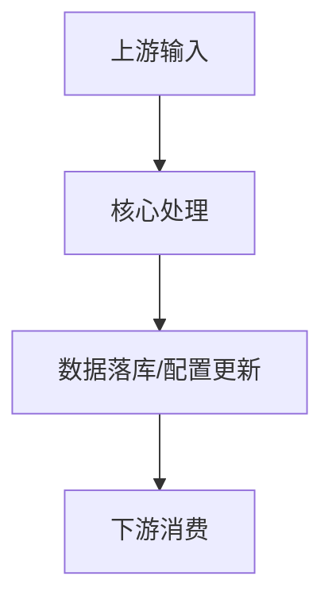

# 技术方案文档模板

> 使用说明：
> 1. 适用于后端职能工程师输出详细技术方案、评审材料、实施设计。
> 2. 必填章节不得删除；不涉及的章节必须明确写“本次不涉及”并说明原因。
> 3. 内容必须基于代码事实、系统交互和外部依赖关系分析，不能只复述需求。

## 1. 需求背景与目标

- 需求背景：
- 业务目标：
- 本次边界：
- 非目标：

## 2. 具体实现

### 2.1 核心改动

- 新增接口 / 能力：
- 关键规则：
- 前后端 / 上下游数据结构：

### 2.2 输入输出结构

- 请求结构：
- 返回结构：
- 批量导入 / 解析结构：

## 3. 影响面评估（必须）

### 3.1 全局业务评估

- 受影响场景：
- 不受影响场景：
- 原因分析：

### 3.2 系统交互拓扑关系评估

- 上游依赖：
- 当前服务改动点：
- 下游影响链路：
- 量化影响范围：

### 3.3 作业和报告服务拆分范围评估

- 是否涉及相同功能代码重构考虑：
- 是否涉及已经重构的保存报告&修改报告范围：
- 若涉及，明确方法入口与统一收口决策：

## 4. 底层数据现状评估

- 当前数据模型现状：
- 历史数据兼容性：
- 新旧数据并存情况：
- 风险说明：

## 5. 技术选型（必须，3W2H）

### 5.1 {场景名} 技术选型

| 维度 | 内容 |
|------|------|
| What | 现象描述 / 设计目标 |
| Why | 本质原因 |
| Who | 需要谁协助 |
| How | 方案1 / 方案2 / 推荐方案 |
| How much | ROI / 风险 / 成本 |
| Decision | 最终决策 |

## 6. 架构设计（如适用）

- 是否涉及新的工程 / 分层 / 模块边界调整：
- 架构图或文字说明：

## 7. 系统流程图 / 泳道图（必须）

## 8. 关键模块核心交互细节（如适用）

- 模块 A：
- 模块 B：
- 核心方法入口：
- 时序 / 状态变化：

## 9. 数据库改动（如有必填）

- 表 / 字段变更：
- 兼容性分析：
- 影子库 / 沙箱 / 线上影响：
- 示例 SQL：

## 10. 大数据影响评估 & Check（需要找大数据确认）

| Check-List | 是否影响 | 影响点 | 审核过程 & 结论 |
|-----------|----------|--------|----------------|
| 新增表 |  |  |  |
| 修改表-加字段 |  |  |  |
| 修改表-改字段 |  |  |  |
| 删除表 |  |  |  |
| 字段内容结构调整 |  |  |  |
| DML 数据更新 |  |  |  |

## 11. 阿波罗配置改动（如有必填）

- Key：
- 默认值：
- 灰度策略：

## 12. 缓存（如有必填）

- Key 设计：
- 失效策略：
- 一致性影响：

## 13. MQ 消息（如有必填）

- Topic：
- 生产 / 消费方：
- 重试 / 幂等 / 监控：

## 14. 接口设计（如有必填）

- 接口地址：
- 使用方：
- 变更类型：
- 兼容性：

## 15. 流程准确性（涉及流程必填）

- 检查方式：
- 监控手段：

## 16. 数据准确性（涉及数据交互必填）

- 校验方式：
- 对账 / 抽样 / 监控方案：

## 17. 并发 & 一致性保障（必须）

- 一致性场景：
- 风险点：
- 解决方案：
- 监控手段：

## 18. 风险点（可选）

- 风险 1：
- 风险 2：

## 19. 灰度设计（必须）

- 是否需要灰度：
- 复杂度评估：
- 重要度评估：
- 灰度方案：
- 灰度计划：

## 20. 上线计划（必须）

| 类型 | 内容 | 负责人 | 是否完成 |
|------|------|--------|----------|
| 上线顺序 |  |  |  |
| 数据库改动 |  |  |  |

## 21. 回滚方案（必须）

- 回滚触发条件：
- 回滚顺序：
- 配置回滚 / 开关回退：
- 数据回滚注意事项：
