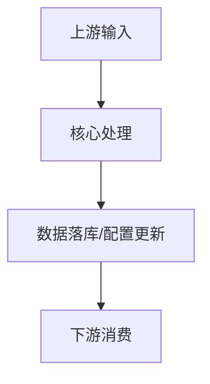

# 技术方案文档模板

> 使用说明：
> 1. 适用于全栈/后端职能工程师输出详细技术方案、评审材料、实施设计。
> 2. 本模板融合转转「AA技术方案设计模版1.0」实战骨架与方案评审深度要求。
> 3. 必填章节不得删除；不涉及的章节必须明确写"本次不涉及"并说明原因。
> 4. 内容必须基于代码事实、系统交互和外部依赖关系分析，不能只复述需求。
> 5. 涉及接口/数据库/配置/缓存/MQ/三方/大数据时，必须填检查方式、监控手段和兼容性分析。

## 一、项目背景（必须）

- 业务背景：基于什么目标（for what）做哪些尝试（do what）
- 业务目标与衡量方式：
- 本次边界 / 非目标：
- 关联文档：需求文档（大神 / tapd 地址）、PRD、相关方案

## 二、开发范围及分工（必须）

| 系统模块 | 功能改动范围 | 涉及新增/改动的服务 | RD 负责人 |
|---------|------------|--------------------|----------|
|  |  |  |  |

> 全栈场景下，本表须与 fullstack 任务组 owner service / 受影响项目对齐。

## 三、整体流程设计（必须，涉及多模块则每模块都列）

### 3.1 总体系统流程图（清晰表示与三方上下游系统的交互）

```mermaid
flowchart TD
    A[上游输入] --> B[核心处理]
    B --> C[数据落库/配置更新]
    C --> D[下游消费]
```

### 3.2 服务调用流程图（需求涉及数据流转的服务调用关系）

- 上游依赖：
- 当前服务改动点：
- 下游影响链路：

### 3.3 关键流程设计（核心设计：缓存构建、状态流转、核心节点触发的数据处理）

- 关键流程 1：
- 状态 / 时序变化：

## 四、影响面评估（必须）

### 4.1 全局业务评估

- 受影响场景：
- 不受影响场景：
- 原因分析（需量化受影响 / 未受影响范围）：

### 4.2 系统交互拓扑关系评估

- 上游依赖：
- 当前服务改动点：
- 下游影响链路：
- 量化影响范围：

### 4.3 新旧逻辑 / 重构收口评估

- 是否涉及相同功能代码重构：
- 是否存在新旧逻辑并存或灰度重构链路：
- 若涉及，明确方法入口与统一收口决策：

## 五、系统交互设计（必须，按交互类型分别填写）

### 5.1 与前端交互接口

| 类型(新增/修改) | 使用场景 | 接口名称 | 接口文档地址 | 字段变更(修改时填) |
|----------------|---------|---------|-------------|-------------------|
|  |  |  |  |  |

### 5.2 与后端上下游 SCF 交互接口

| 类型(新增/修改) | 接口名称 | 接口文档地址 | 兼容性说明 |
|----------------|---------|-------------|-----------|
|  |  |  |  |

### 5.3 与后端/爬虫消息（MQ / kafka）交互

| 交互类型(生产/消费) | 类型(新增/修改) | Topic:Tag | 消息体格式及字段含义 | 重试/幂等/监控 |
|--------------------|----------------|-----------|---------------------|---------------|
|  |  |  |  |  |

### 5.4 与三方平台交互（如有）

主动从三方平台获取数据：

| 平台名称 | 接口能力描述 | 接口文档 | 接口请求限制 | 限流方案(如何不超 QPS) |
|---------|------------|---------|-------------|----------------------|
|  |  |  |  |  |

被动从三方平台监测数据：

| 平台名称 | 监测能力描述 | 监测链接地址 | 预估请求 QPS | 限流方案 |
|---------|------------|-------------|-------------|---------|
|  |  |  |  |  |

## 六、数据存储设计

### 6.1 缓存设计（如有）

| 缓存类型(本地/Redis) | 缓存场景 | 类型(新增/修改) | 缓存 KEY | 数据格式 | 缓存时长 | 所在服务 | 更新时机说明 |
|---------------------|---------|----------------|---------|---------|---------|---------|-------------|
|  |  |  |  |  |  |  |  |

### 6.2 数据库表设计（如有，必填 DDL）

| 类型(新增/修改) | 表 / 字段 | DDL / 兼容性说明 |
|----------------|----------|------------------|
|  |  |  |

- 历史数据兼容性：
- 新旧数据并存情况与风险：
- 影子库 / 沙箱 / 线上影响：

### 6.3 索引设计（如有）

| 类型(新增/修改) | 索引场景 | 字段 | 含义 |
|----------------|---------|------|------|
|  |  |  |  |

### 6.4 阿波罗配置设计（如有）

| 系统模块 | 阿波罗应用名 | 配置 KEY | 默认值 | 灰度策略 | 含义说明 |
|---------|------------|---------|-------|---------|---------|
|  |  |  |  |  |  |

## 七、大数据影响评估 & Check（涉及表变更须找大数据确认）

| Check-List | 是否影响 | 影响点 | 审核过程 & 结论 |
|-----------|---------|-------|----------------|
| 新增表 |  |  |  |
| 修改表-加字段 |  |  |  |
| 修改表-改字段 |  |  |  |
| 删除表 |  |  |  |
| 字段内容结构调整 |  |  |  |
| DML 数据更新 |  |  |  |

## 八、技术选型（必须，3W2H）

### 8.1 {场景名} 技术选型

| 维度 | 内容 |
|------|------|
| What | 现象描述 / 设计目标 |
| Why | 本质原因 |
| Who | 需要谁协助 |
| How | 方案1 / 方案2 / 推荐方案 |
| How much | ROI / 风险 / 成本 |
| Decision | 最终决策 |

> 技术选型必须自证为什么这是推荐方案或唯一方案。

## 九、并发 & 一致性保障（必须）

- 一致性场景：
- 风险点：
- 解决方案：
- 监控手段：

## 十、流程 & 数据准确性（涉及流程/数据交互必填）

- 流程准确性：检查方式 / 监控手段
- 数据准确性：校验方式 / 对账 / 抽样 / 监控方案

## 十一、存量数据兼容方案（如有）

- 存量数据现状：
- 兼容 / 清洗 / 迁移方案：
- 灰度期间新旧并存处理：

## 十二、建议测试点（开发视角补充）

| 功能点 | 测试范围说明 |
|-------|-------------|
|  |  |

## 十三、问题 & 风险沟通

| 问题 / 风险 | 解法 / 结论 |
|------------|------------|
|  |  |

## 十四、灰度设计（必须）

- 是否需要灰度：
- 复杂度评估 / 重要度评估：
- 灰度方案（按用户/流量/开关维度）：
- 灰度计划：

## 十五、上线计划 List（必须，测试阶段补充明细）

### 15.1 服务器资源申请

| 服务名 | Docker 节点数 | CPU | 内存 | 是否申请完成 |
|-------|--------------|-----|------|-------------|
|  |  |  |  |  |

### 15.2 调用关系申请（SCF）

| 调用方 | 服务方 | 分钟调用量 | 是否申请完成 |
|-------|-------|-----------|-------------|
|  |  |  |  |

### 15.3 SQL 线上配置

| 具体 SQL | 是否配置完成 |
|---------|-------------|
|  |  |

### 15.4 服务上线顺序

| 上线序号 | 服务 | 分支 | 上线状态 | 负责人 | 依赖 |
|---------|------|------|---------|-------|------|
|  |  |  |  |  |  |

### 15.5 网关配置

| 服务名 | 接口路径 | 是否完成统一网关配置 |
|-------|---------|---------------------|
|  |  |  |

## 十六、回滚计划（必须）

- 回滚触发条件：
- 回滚顺序：
- 配置回滚 / 开关回退：
- 数据回滚注意事项：

